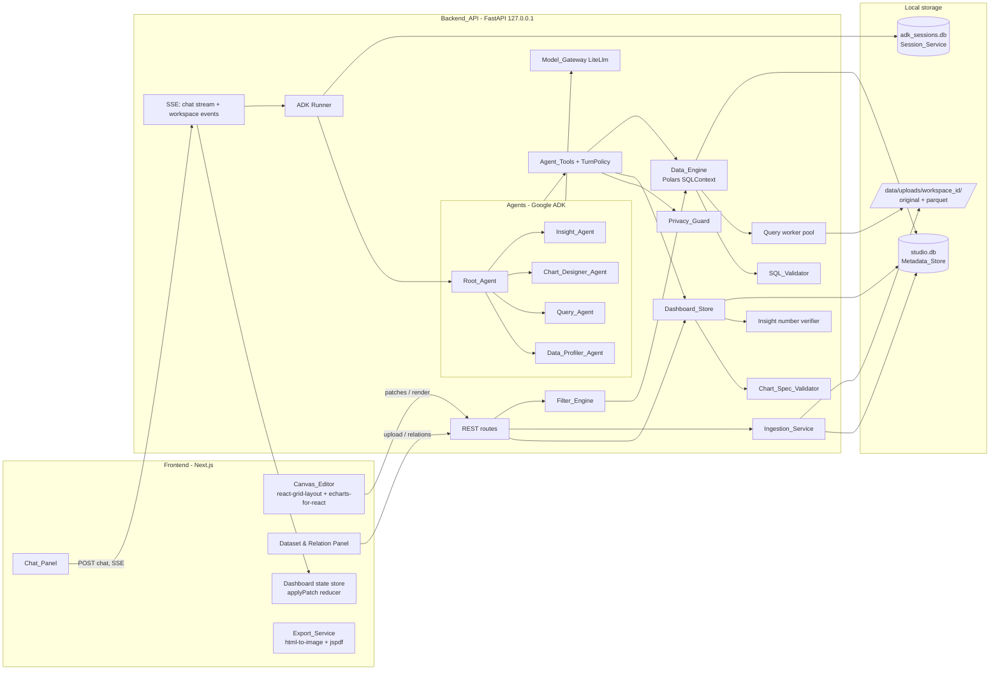
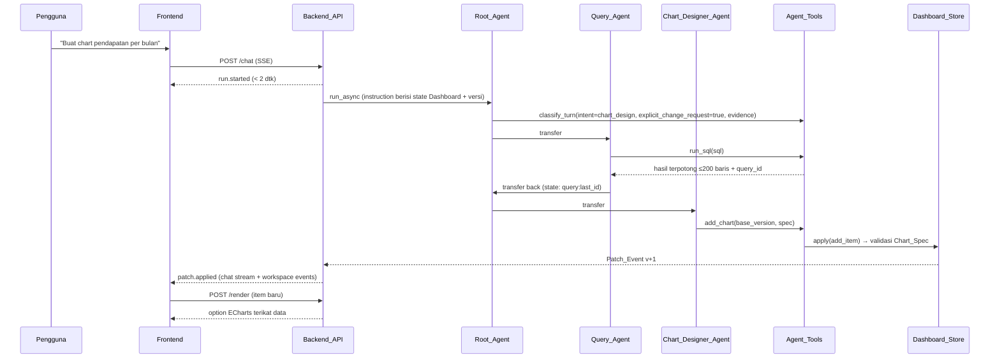
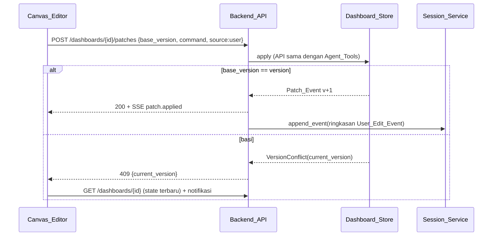
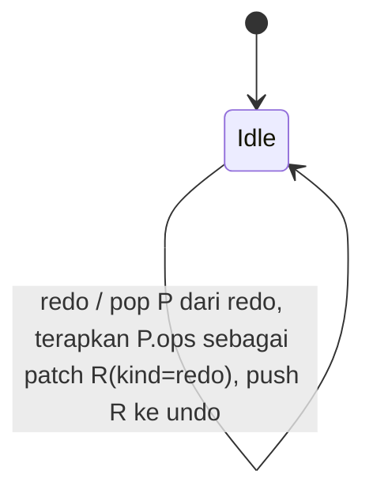
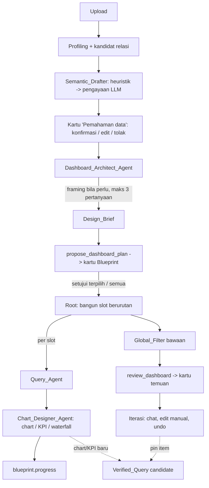

# Design Document

## Overview

Dashboard Studio Agent adalah aplikasi lokal single-user yang terdiri dari dua proses:

- **Frontend** — Next.js (React + TypeScript, dikelola dengan bun) berisi Chat_Panel, Canvas_Editor (react-grid-layout), panel dataset/relasi, dan Export_Service (client-side). Chart dirender dengan echarts-for-react.
- **Backend_API** — Python FastAPI yang dijalankan dengan `python main.py` (uvicorn di-embed), bind default `127.0.0.1`. Backend meng-host multi-agent Google ADK (Root_Agent + 4 sub-agent), Data_Engine berbasis Polars, Dashboard_Store berversi, Filter_Engine, dan penyimpanan lokal (SQLite + folder `data/uploads/{workspace_id}/`).

Prinsip desain utama:

1. **Backend adalah sumber kebenaran tunggal.** Semua perubahan Dashboard (dari agent maupun pengguna) melewati satu jalur: `DashboardStore.apply(command, base_version, source)` yang menghasilkan Patch_Event berversi dan disiarkan melalui SSE (Req 17.5, 18).
2. **LLM tidak pernah menyentuh data mentah atau mengeksekusi kode.** LLM hanya menghasilkan SQL (divalidasi SQL_Validator, dieksekusi `pl.SQLContext`), Chart_Spec (divalidasi, data diikat backend), dan teks insight (angka diverifikasi terhadap hasil query). Semua payload ke LLM melewati Privacy_Guard (Req 8.4, 13, 14, 27).
3. **Logika deterministik dipisah sebagai fungsi murni** di paket `studio/core/` (normalisasi nama, diff skema, patch/undo, filter & propagasi, validasi SQL, validasi Chart_Spec, verifikasi angka, privacy). Modul ini tidak bergantung pada FastAPI/ADK sehingga dapat diuji dengan Hypothesis (Req 30.1).
4. **Status turunan dihitung, bukan disimpan.** Status "tidak valid karena relasi dihapus" (Req 7.8), "perlu refresh setelah re-upload" (Req 26.2), dan "filter berbeda" (Req 15.3) dihitung saat baca dari metadata, sehingga tidak memerlukan Patch_Event tambahan dan tidak bisa out-of-sync.

Ekstensi Requirement 31–39 (Model Semantik, Dashboard_Architect_Agent, Design_Brief, Dashboard_Blueprint, KPI_Card, review desain) dijelaskan di bagian [Ekstensi v2](#ekstensi-v2-model-semantik-dashboard_architect_agent-dan-blueprint) di akhir dokumen, termasuk Properti 36–43.

### Keputusan desain & hasil riset

| Topik | Keputusan | Alasan / sumber |
|---|---|---|
| Session storage ADK | `DatabaseSessionService(db_url="sqlite+aiosqlite:///<absolute path>/data/adk_sessions.db")` | Rilis ADK terbaru memakai driver async; ada isu path relatif pada aiosqlite ([adk-python#4077](https://github.com/google/adk-python/issues/4077)) sehingga path dibuat absolut. Skema sesi v1 berbasis JSON sejak ADK v1.22 ([ADK docs](https://google.github.io/adk-docs/sessions/session/migrate/)). File terpisah dari Metadata_Store agar tabel ADK tidak bentrok. |
| Cek tool-calling model | `litellm.supports_function_calling(model=...)` saat startup | API resmi LiteLLM untuk kapabilitas function calling ([LiteLLM docs](https://docs.litellm.ai/docs/completion/function_call)). |
| Konversi file besar | Pembacaan batch Polars (`scan_csv(...).collect_batches()` / `read_csv_batched`) → `pyarrow.parquet.ParquetWriter` | Engine streaming Polars memproses per batch sehingga tekanan memori rendah ([Polars collect_batches](https://docs.pola.rs/api/python/stable/reference/lazyframe/api/polars.LazyFrame.collect_batches.html), [sources & sinks](https://docs.pola.rs/user-guide/lazy/sources_sinks/)). Batch manual dipilih (bukan `sink_parquet` tunggal) agar progres persentase dapat dilaporkan. |
| Parsing & analisis SQL | `sqlglot` (dialek generic/duckdb-like) untuk cek statement, tabel, JOIN, table function; lalu `pl.SQLContext.execute(...).collect_schema()` | Polars SQL tidak menyediakan AST publik; sqlglot memberi AST dan lineage kolom (dipakai untuk cross-filter). |
| Timeout 60 detik | Eksekusi query di worker process terpisah (pool `spawn`), di-terminate saat timeout | `collect()` Polars tidak dapat dibatalkan dari thread lain; membunuh proses adalah satu-satunya pembatalan yang andal. |
| Delegasi agent | Root_Agent memiliki `sub_agents=[...]` (hierarki ADK, transfer LLM-driven); state antar-agent via session state | Memenuhi Req 8.1 (Root sebagai induk). Hasil sub-agent (mis. `query_id`) disimpan di state, bukan di teks. |
| Ekspor PNG/PDF | Client-side: `html-to-image` untuk canvas + `jspdf` untuk PDF | Tidak perlu headless browser di backend; ekspor bersifat read-only terhadap state. |
| Property-based testing | Hypothesis (backend), Vitest (+ `fast-check` opsional) (frontend) | Req 30. |

## Architecture

### Diagram komponen



### Alur utama: chat → chart



### Alur edit manual



### Model proses & konkurensi

- Satu proses uvicorn (asyncio). I/O SQLite memakai `aiosqlite`; akses tulis ke satu Dashboard diserialisasi dengan `asyncio.Lock` per `dashboard_id` ditambah pemeriksaan versi optimistik di SQL (`UPDATE ... WHERE version = ?`).
- Query Polars dieksekusi di `QueryWorkerPool` (N = `min(4, cpu_count)` proses `spawn`). Job dikirim sebagai deskripsi JSON (path Parquet, predikat filter, rencana propagasi, SQL) — bukan objek LazyFrame — sehingga worker membangun `SQLContext` sendiri. Hasil dikembalikan sebagai Arrow IPC bytes. Timeout 60 dtk → proses di-terminate dan diganti (Req 10.6).
- Konversi upload berjalan sebagai background task (`asyncio.to_thread` untuk batch Polars) yang melaporkan progres via event bus in-process → SSE workspace.
- Chat run dilacak di `RunRegistry {run_id: asyncio.Task}`; tombol stop membatalkan task (Req 16.6).

## Components and Interfaces

### Struktur direktori proyek

```
agent-generate-dahsboard/
├── backend/
│   ├── main.py                     # entrypoint: load .env, validasi model, uvicorn.run(host, port)
│   ├── pyproject.toml              # dependensi pinned; extras [dev]: pytest, hypothesis, xlsxwriter
│   ├── .env.example
│   ├── studio/
│   │   ├── config.py               # Settings (pydantic-settings): HOST, PORT, DATA_DIR, CORS_ORIGINS, MODEL_*
│   │   ├── app.py                  # create_app(): FastAPI, CORS, routers, lifespan (DB init, worker pool)
│   │   ├── api/
│   │   │   ├── workspaces.py  datasets.py  relations.py  dashboards.py
│   │   │   ├── chat.py        events.py    queries.py
│   │   │   ├── schemas.py              # Pydantic request/response
│   │   │   └── errors.py               # StudioError → envelope JSON
│   │   ├── core/                       # FUNGSI MURNI (target Hypothesis)
│   │   │   ├── identifiers.py          # normalize_columns, make_table_name, sanitize_filename
│   │   │   ├── schema_diff.py          # diff_schemas, types_compatible
│   │   │   ├── patches.py              # Op types, apply_ops, invert_ops, replay
│   │   │   ├── history.py              # undo/redo stack logic
│   │   │   ├── filters.py              # Predicate, normalize_filters, apply_predicates
│   │   │   ├── propagation.py          # RelationGraph, plan_propagation, affected_tables
│   │   │   ├── sql_rules.py            # analyze_sql (sqlglot): statement, tables, joins, table functions
│   │   │   ├── chart_spec.py           # ChartSpec model, validate_chart_spec, bind_data
│   │   │   ├── chart_convert.py        # convert_chart_type
│   │   │   ├── numbers.py              # extract_numbers, format_number (id-ID), verify_insight_numbers
│   │   │   ├── privacy.py              # build_dataset_context, truncate_result
│   │   │   ├── relations.py            # score_candidates, cardinality, candidate_key
│   │   │   ├── status.py               # derived item status (invalid/stale)
│   │   │   └── models_config.py        # resolve_models(env) → per-agent model / error
│   │   ├── data/
│   │   │   ├── ingestion.py            # IngestionService (orchestrasi job upload)
│   │   │   ├── csv_reader.py  xlsx_reader.py  parquet_writer.py
│   │   │   ├── engine.py               # DataEngine: register tables, validate, execute
│   │   │   ├── worker.py               # QueryWorkerPool + worker entry
│   │   │   └── profiler.py             # compute_column_profiles, classify_roles, compute_overlap
│   │   ├── store/
│   │   │   ├── db.py                   # koneksi aiosqlite, migrasi
│   │   │   ├── migrations/001_init.sql
│   │   │   ├── repos.py                # Workspace/Dataset/Relation/Query/Dashboard repositories
│   │   │   └── dashboard_store.py      # DashboardStore.apply/undo/redo/get/patches_since
│   │   ├── agents/
│   │   │   ├── model_gateway.py        # build LiteLlm per agent + capability check
│   │   │   ├── root.py profiler.py query.py chart.py insight.py
│   │   │   ├── prompts/*.md            # instruksi agent
│   │   │   ├── context.py              # InstructionProvider: state Dashboard + versi + edit manual
│   │   │   ├── turn_policy.py          # approval gate + retry counter
│   │   │   ├── tools/data_tools.py  dashboard_tools.py  turn_tools.py
│   │   │   └── runner.py               # Runner + DatabaseSessionService + RunRegistry
│   │   └── events/
│   │       ├── bus.py                  # pub/sub in-process per workspace
│   │       └── sse.py                  # format event SSE (id, event, data)
│   └── tests/
│       ├── property/   unit/   integration/
│       └── eval/
│           ├── studio.evalset.json
│           ├── test_eval.py            # AgentEvaluator + metrik kustom
│           └── samples/customers.csv  transactions.csv  products.xlsx
├── frontend/
│   ├── package.json  bun.lock  next.config.ts  vitest.config.ts  tsconfig.json
│   └── src/
│       ├── app/                        # routes: / (daftar workspace), /w/[workspaceId]
│       ├── components/chat/  canvas/  datasets/  relations/  filters/  insights/  export/
│       └── lib/
│           ├── api.ts                  # REST client
│           ├── sse.ts                  # EventSource workspace + fetch-stream chat
│           ├── dashboard-state.ts      # reducer applyPatch (mirror core/patches.py)
│           ├── filters.ts              # filtersDiffer, cross-filter toggle
│           └── types.ts
├── data/                               # runtime, di-.gitignore
│   ├── studio.db  adk_sessions.db
│   └── uploads/{workspace_id}/
└── README.md
```

`DATA_DIR` default adalah `<repo>/data` (di-resolve absolut dari lokasi `backend/`).

### Backend: modul inti

#### Model_Gateway (`agents/model_gateway.py`, `core/models_config.py`)

```python
AGENT_ENV = {"root": "MODEL_ROOT", "profiler": "MODEL_PROFILER", "query": "MODEL_QUERY",
             "chart": "MODEL_CHART", "insight": "MODEL_INSIGHT"}

def resolve_models(env: Mapping[str, str]) -> dict[str, str]:
    """Murni. Raise MissingModelConfig([nama variabel]) bila var agent & MODEL_DEFAULT kosong."""

def build_models(resolved: dict[str, str], supports_tools=litellm.supports_function_calling) -> dict[str, LiteLlm]:
    """Raise ModelCapabilityError(agent, model) bila supports_tools(model) False atau melempar exception."""
```

`main.py` memanggil keduanya sebelum `uvicorn.run`; kegagalan dicetak ke stderr dan `sys.exit(1)` (Req 9.4, 9.5). Nilai kosong/whitespace dianggap tidak diset.

#### Ingestion_Service (`data/ingestion.py`)

| Fungsi | Perilaku |
|---|---|
| `sanitize_filename(name) -> str` | Ambil basename setelah memisah `/` dan `\`, hapus `..`, karakter kontrol, dan karakter `<>:"|?*`; kosong → `upload`; prefiks ULID agar unik. Path final diverifikasi `resolve().is_relative_to(workspace_dir)` (Req 29.5). |
| `check_extension(name)` | Hanya `.csv` / `.xlsx` (case-insensitive), selain itu `UnsupportedFormat` (Req 2.4). |
| `start_csv_job(ws, file)` | Simpan file asli (streaming chunk 1 MiB dari request body) → job konversi. |
| `list_sheets(path)` | `fastexcel.read_excel(path).sheet_names`; error baca → `UnreadableWorkbook` (Req 3.4). |
| `start_sheet_jobs(ws, upload_id, sheets)` | Satu job per sheet terpilih; sheet tanpa baris data → `EmptySheet(sheet)` (Req 3.3). |
| `reupload(ws, dataset_id, file)` | Parse ke Parquet sementara → `diff_schemas` → ganti file secara atomik (`os.replace`) atau tolak dengan diff (Req 26). |

Pipeline CSV:

1. **Validasi encoding**: stream byte, decode UTF-8 (BOM diterima); gagal → `ParseError(cause="encoding", line=n)`.
2. **Inferensi skema**: `pl.scan_csv(path, infer_schema_length=10_000, try_parse_dates=True)`; header dinormalisasi `normalize_columns` (Req 2.5). Tipe Polars dipetakan ke 6 tipe logis (Int*→integer, Float*→float, String→string, Boolean→boolean, Date→date, Datetime→datetime; lainnya/Null → string).
3. **Konversi batch**: iterasi batch 100.000 baris, cast ke skema terinferensi, tulis ke `ParquetWriter` (zstd). Jika cast gagal di batch berikutnya, tipe kolom dilebarkan (integer→float→string) dan konversi diulang sekali dengan skema baru.
4. **Lokasi error baris**: bila Polars melempar error jumlah kolom, `csv_reader.locate_bad_row()` memindai ulang dengan modul `csv` stdlib secara streaming dan mengembalikan nomor baris (1-based, termasuk header) pertama yang jumlah field-nya berbeda (Req 2.3). File kosong / hanya header → `ParseError(cause="empty")`.
5. **Progres**: `progress = min(99, bytes_estimated_processed / file_size * 100)` dengan estimasi `rows_done * avg_row_bytes` (dari sampel); event `job.progress` dikirim tiap batch dan heartbeat ≤ 1 dtk; 100 saat dataset terdaftar (Req 5.3).
6. **Finalisasi**: tulis ke `*.parquet.partial` → `os.replace` ke nama final → insert Dataset (dalam satu transaksi). Kegagalan/terputus → hapus `.partial` dan file asli yang tidak lengkap; Dataset tidak didaftarkan (Req 5.5).

Pipeline XLSX memakai `pl.read_excel(path, sheet_name=..., engine="calamine")` untuk sheet ≤ 100 MB; untuk file lebih besar dibaca per blok baris via `fastexcel` (`load_sheet(..., skip_rows, n_rows)`) lalu ditulis per batch ke Parquet (Req 3.1, 5.2).

#### Data_Engine (`data/engine.py`, `data/worker.py`)

```python
class DataEngine:
    async def validate(self, ws_id: str, sql: str) -> ValidatedQuery      # SQL_Validator penuh
    async def execute(self, ws_id: str, sql: str, filters: FilterSet | None = None,
                      timeout_s: float = 60.0) -> QueryResult             # via QueryWorkerPool
    async def profile(self, dataset_id: str) -> list[ColumnProfile]
    async def overlap(self, a: ColumnRef, b: ColumnRef) -> OverlapStats
```

Worker membangun konteks per permintaan:

```python
frames = {t.table_name: pl.scan_parquet(t.parquet_path) for t in workspace_tables}
frames = filter_engine.apply(frames, plan)          # LazyFrame terfilter, nama tabel sama
ctx = pl.SQLContext(frames=frames, eager=False)
lf = ctx.execute(sql)                              # SQL teks tidak diubah (Req 22.2)
df = lf.collect(engine="streaming")                # hanya materialisasi hasil akhir (Req 5.4)
```

`QueryResult = {query_id, columns: [{name, type}], rows, row_count, truncated_for_storage}`. Setiap SQL yang dieksekusi disimpan di tabel `queries` beserta ringkasan (kolom, `row_count`, maks 1.000 baris snapshot) (Req 10.7).

#### SQL_Validator (`core/sql_rules.py` + `DataEngine.validate`)

Aturan, dievaluasi berurutan; pelanggaran pertama menghentikan validasi dan tidak ada eksekusi:

| # | Aturan | Kode error |
|---|---|---|
| V1 | `sqlglot.parse(sql)` menghasilkan tepat 1 statement non-kosong (titik koma di akhir diizinkan) | `MULTIPLE_STATEMENTS` / `PARSE_ERROR` |
| V2 | Root statement adalah `Select`, `Union/Intersect/Except` dari Select, atau `With` yang body-nya Select | `NOT_SELECT` (menyebut jenis statement, mis. `INSERT`) |
| V3 | Tidak ada node DML/DDL/command di mana pun dalam AST (Insert, Update, Delete, Drop, Create, Alter, Copy, Command, Pragma, Attach) | `FORBIDDEN_STATEMENT` |
| V4 | Tidak ada table function / pembacaan file (`read_csv`, `read_parquet`, `read_json`, `read_ipc`, dsb.) atau literal path sebagai sumber tabel | `FORBIDDEN_SOURCE` |
| V5 | Setiap tabel yang direferensikan (di luar nama CTE) adalah tabel terdaftar di Workspace | `UNKNOWN_TABLE` + daftar tabel |
| V6 | Untuk setiap JOIN antara dua tabel Workspace **berbeda**: kondisi `ON` harus berupa konjungsi kesetaraan kolom (atau `USING`), dan setiap pasangan `(t1.c1, t2.c2)` harus ada di Confirmed_Relation (pasangan tak berurut). CROSS JOIN / comma join antar-Dataset berbeda ditolak. Self-join diizinkan. Alias dan CTE di-resolve ke tabel dasar melalui scope sqlglot. | `UNCONFIRMED_JOIN` + pasangan kolom (Req 7.7) |
| V7 | `ctx.execute(sql)` (lazy) lalu `lf.collect_schema()` berhasil | `POLARS_ERROR` + pesan Polars + katalog `{tabel: [kolom:tipe]}` (Req 11.2) |

Output validasi: `ValidatedQuery {sql, tables_used, relations_used: [relation_id], output_schema, lineage: {output_col: (table, column) | None}}`. `relations_used` dipakai untuk status invalid (Req 7.8) dan `lineage` untuk cross-filter.

#### Filter_Engine (`core/filters.py`, `core/propagation.py`)

Predikat dan penerapan dasar:

```python
@dataclass(frozen=True)
class Predicate:
    table: str; column: str
    kind: Literal["date_range", "in"]
    start: date | None = None; end: date | None = None   # inklusif, salah satu boleh None
    values: frozenset[Scalar] = frozenset()

def normalize_filters(preds: Iterable[Predicate]) -> FilterSet   # dedupe (set), urutan kanonik
def to_expr(p: Predicate) -> pl.Expr                               # date_range: is_between; in: is_in
def apply_predicates(lf, preds) -> LazyFrame                       # lf.filter(AND semua predikat tabel)
```

Karena FilterSet adalah himpunan dan filter adalah konjungsi, penerapan bersifat idempoten dan konfluen (Req 22.6, 22.7).

**Algoritma propagasi semi-join** (Req 23). Graf `G` tak berarah: simpul = tabel Workspace, sisi = Confirmed_Relation `(A.a ↔ B.b)`; hanya Confirmed_Relation yang masuk graf (Req 23.2).

```
plan_propagation(G, filter_set):
  sources = tabel yang memiliki predikat langsung
  plan = {}                                   # tabel → daftar Constraint
  for S in sources (urutan kanonik):
      visited = {S}; queue = [S]; parent = {}
      while queue:
          U = queue.pop(0)
          for (U.u ↔ V.v) in G.edges(U) (urutan kanonik):
              if V in visited: continue       # siklus: tiap tabel paling banyak sekali per sumber (Req 23.4)
              visited.add(V); parent[V] = (U, u, v); queue.append(V)
      for V in visited - {S}:
          plan[V].append(Constraint(source=S, path=jalur parent dari S ke V))
  return plan

materialize(frames, filter_set, plan):
  direct[T] = apply_predicates(scan(T), preds[T])            # hanya predikat langsung
  for V, constraints in plan:
      out = direct[V] if V punya predikat langsung else scan(V)
      for c in constraints:
          keys = rantai semi-join sepanjang c.path, dimulai dari direct[S]
                 dan melewati tabel antara dalam bentuk scan() dasar
          out = out.join(keys.select(pl.col(u)).unique(), left_on=v, right_on=u, how="semi")
      result[V] = out
  tabel tanpa predikat & tanpa constraint → scan() tanpa perubahan
```

Sifat yang dijamin: setiap constraint hanya bergantung pada predikat langsung sumbernya (bukan hasil propagasi lain), sehingga hasil akhir = konjungsi independen → tidak bergantung urutan filter; setiap nilai kunci pada tabel hasil propagasi ada di kunci tabel induk yang terfilter (Req 23.5). Interpretasi Req 23.4: dalam satu permintaan render, BFS per sumber mengunjungi setiap tabel paling banyak sekali sehingga propagasi selalu berhenti meski graf bersiklus; jalur yang dipilih adalah jalur BFS terpendek dengan tie-break urutan kanonik (nama tabel, lalu relation_id).

`affected_tables(G, filter_set) = sources ∪ reachable(sources)`. Chart terpengaruh ⇔ `tables_used(chart.query) ∩ affected_tables ≠ ∅`; selain itu chart diberi flag `filter_unaffected` (Req 23.3).

**Cross_Filter** (Req 24) direpresentasikan sebagai `Predicate(kind="in", values={v})` pada `(table, column)` hasil lineage kolom dimensi chart sumber. Cross_Filter bersifat state tampilan (dikirim di request render, tidak disimpan sebagai Patch_Event) dan diterapkan ke semua chart **kecuali** chart sumbernya. Klik elemen yang sama dua kali men-toggle predikat tersebut (logika di `frontend/src/lib/filters.ts`).

#### Chart_Spec_Validator & binding (`core/chart_spec.py`, `core/chart_convert.py`)

```python
def validate_chart_spec(spec: dict, result_schema: list[ColumnInfo]) -> ChartSpec   # raise ChartSpecError(code, path, detail)
def bind_data(spec: ChartSpec, result: QueryResult) -> dict                        # option ECharts siap render
def convert_chart_type(spec: ChartSpec, new_type: str, result_schema) -> ChartSpec   # untuk Req 17.3
```

Aturan validasi (Req 13):

| # | Aturan | Kode |
|---|---|---|
| C1 | Top-level `option` hanya berisi key allowlist: `title, legend, tooltip, grid, xAxis, yAxis, series, color, dataZoom, visualMap, toolbox`; key `dataset` dilarang (disediakan backend) | `UNKNOWN_KEY` / `INLINE_DATA` |
| C2 | `series[].type` ∈ {`line`, `bar`, `pie`, `scatter`, `heatmap`}, konsisten dengan `chart_type` | `UNSUPPORTED_SERIES` |
| C3 | Tidak ada `series[].data`, `xAxis[].data`, `yAxis[].data`, atau `dataset.source` | `INLINE_DATA` (Req 13.2) |
| C4 | Setiap `series[].encode` ada dan setiap nama kolom di dalamnya ada di skema hasil query (`query_id`) | `UNKNOWN_COLUMN` + nama kolom (Req 13.3) |
| C5 | Struktur sumbu: cartesian (`line/bar/scatter/heatmap`) wajib `xAxis` & `yAxis`; `pie` tidak boleh punya sumbu; pie maks 8 kategori dicek saat render (lebih → agregasi "Lainnya" tidak dilakukan, agent diminta memakai bar) | `AXIS_STRUCTURE` |
| C6 | Semua nilai adalah tipe JSON (tanpa fungsi); string tidak boleh cocok pola kode: `function\s*\(`, `=>`, `javascript:`, `<script`, `new Function`, `eval\(` | `CODE_VALUE` (Req 13.4) |
| C7 | Ukuran spec ≤ 64 KB, kedalaman ≤ 12 | `TOO_LARGE` |

String template ECharts (mis. formatter `"{b}: {c}"`) diizinkan karena bukan kode. Frontend tidak pernah melakukan `eval` terhadap string spec.

`bind_data` menambahkan `option.dataset = {"dimensions": [kolom...], "source": [[...baris...]]}`; series memakai `encode` sehingga ECharts membaca data dari dataset (Req 12.3). Nilai date/datetime diserialisasi ISO-8601.

`convert_chart_type`: bar↔line mempertahankan `encode {x, y}`; ke pie: `itemName = x`, `value = y[0]`, sumbu dihapus; ke scatter: butuh dua kolom measure numerik di skema (jika tidak ada → error `INCOMPATIBLE_TYPE`); hasilnya selalu divalidasi ulang sebelum disimpan.

#### Insight number verification (`core/numbers.py`)

1. `extract_numbers(text) -> list[NumberToken]`: regex mengenali bilangan dengan pemisah ribuan/desimal format id-ID (`1.234.567,89`) maupun en (`1,234,567.89`), persen (`12,5%`), tanda minus, dan sufiks skala (`rb`/`ribu`=1e3, `jt`/`juta`=1e6, `M`/`miliar`=1e9, `T`/`triliun`=1e12). Token ambigu (mis. `1.234`) menghasilkan beberapa interpretasi.
2. `allowed_values(evidence)`: semua sel numerik hasil query; bilangan yang muncul di sel string (mis. `2024` dalam `"2024-01"`); nilai filter aktif; `row_count`.
3. Token `n` dengan `d` digit desimal cocok dengan nilai `v` bila ada interpretasi sehingga `round(v / skala, d) == n`, atau untuk persen `round(v * 100, d) == n` atau `round(v, d) == n`.
4. Token yang tidak cocok → `InsightNumberMismatch(unmatched=[teks token])` dikembalikan ke Insight_Agent (Req 14.4). Tool `add_insight` juga memastikan `insight_type == "cross_dataset_correlation"` hanya bila `tables_used` ≥ 2 dan `relations_used` tidak kosong (Req 14.6).

`format_number(v, decimals, scale)` (id-ID) disediakan ke agent melalui instruksi agar angka di teks konsisten dengan verifier.

#### Privacy_Guard (`core/privacy.py`)

```python
def build_dataset_context(dataset: DatasetMeta, profile: list[ColumnProfile],
                          sample: pl.DataFrame, settings: PrivacySettings) -> dict
def truncate_result(result: QueryResult, limit: int = 200) -> dict   # {columns, rows[:200], row_count, truncated: bool}
```

- Konteks dataset hanya berisi: nama tabel, skema, Column_Profile, dan `sample_rows[:settings.sample_rows]` (default 5) (Req 27.1, 27.2).
- Jika `no_samples=True`: `sample_rows` dihilangkan dan `top_values` dihapus dari profil kolom bertipe string (Req 27.4, 27.5).
- Semua Agent_Tools yang mengembalikan data ke LLM wajib memanggil salah satu fungsi di atas; ini ditegakkan oleh dekorator `@llm_output` yang memeriksa bentuk return, ditambah `after_tool_callback` ADK yang menolak hasil tool yang memuat > 200 baris (Req 27.6).
- Data lengkap untuk rendering tidak pernah melewati LLM; binding dilakukan backend.

#### Dashboard_Store (`store/dashboard_store.py`, `core/patches.py`, `core/history.py`)

```python
class DashboardStore:
    async def get(self, dashboard_id) -> DashboardSnapshot                  # content + version + can_undo/can_redo
    async def apply(self, dashboard_id, command: Command, base_version: int,
                    source: Literal["agent", "user"], actor_run_id: str | None = None) -> PatchEvent
    async def undo(self, dashboard_id, base_version: int | None, source) -> PatchEvent
    async def redo(self, dashboard_id, base_version: int | None, source) -> PatchEvent
    async def patches_since(self, dashboard_id, version: int) -> list[PatchEvent]
```

`apply` dalam satu transaksi SQLite: (1) cek `base_version == version` (lebih lama → `VersionConflict(current_version)`; lebih baru dari versi saat ini juga ditolak), (2) resolve `Command` → `ops` penuh (dengan snapshot `before`), (3) validasi (Chart_Spec_Validator / verifier insight), (4) `content' = apply_ops(content, ops)`, (5) `inverse = invert_ops(ops)`, (6) insert `patch_events`, update `dashboards SET content, version = version + 1 WHERE version = base_version`, update stack undo/redo, (7) publish `patch.applied`, (8) bila `source == "user"`, append ringkasan ke sesi ADK (Req 20.1). Agent_Tools dan endpoint REST keduanya memanggil `apply` (Req 17.5).

### Agents (ADK)

| Agent | Tanggung jawab | Tools |
|---|---|---|
| Root_Agent | Klasifikasi intent, delegasi, penyampaian hasil/kegagalan, penawaran draft | `classify_turn`, `get_dashboard_state`, `propose_changes`, `present_profile_summary`, `present_relation_candidates`, `undo_last` |
| Data_Profiler_Agent | Ringkasan profil, peran kolom, kandidat relasi | `get_dataset_profile`, `set_column_roles`, `compute_relation_candidates` |
| Query_Agent | SQL + retry perbaikan | `list_tables`, `run_sql` |
| Chart_Designer_Agent | Pilih tipe chart, susun/ubah Chart_Spec | `get_query_schema`, `add_chart`, `update_chart`, `remove_chart`, `update_layout` |
| Insight_Agent | Insight berbasis bukti, refresh teks | `get_query_result`, `run_sql`, `add_insight`, `update_insight` |

- Semua agent adalah `LlmAgent(model=models[agent_key], instruction=..., tools=[...])`; Root: `sub_agents=[profiler, query, chart, insight]` (Req 8.1). Sub-agent diinstruksikan transfer kembali ke Root setelah selesai; hasil terstruktur ditulis ke session state (`query:last_id`, `chart:last_id`, `error:last`).
- **InstructionProvider** Root (`agents/context.py`) menyisipkan per giliran: daftar dataset (via Privacy_Guard), Confirmed_Relation, ringkasan state Dashboard (item, judul, tipe, posisi), `dashboard_version`, dan edit manual sejak giliran agent terakhir (Req 20.2).
- **TurnPolicy / approval gate** (Req 21.3, 21.4): state `temp:mutation_allowed` (prefiks `temp:` ADK = berlaku satu invocation) di-set `True` bila (a) pesan dikirim dari aksi persetujuan UI yang membawa `approval.proposal_id` valid (hasil `propose_changes` sebelumnya), atau (b) `classify_turn` dipanggil dengan `explicit_change_request=true` dan `evidence` berupa kutipan verbatim (≥ 3 karakter) yang merupakan substring pesan pengguna giliran ini. Semua tool mutasi (`add_*`, `update_*`, `remove_*`, `update_layout`, `undo_last`) mengecek flag ini lebih dulu dan mengembalikan error `APPROVAL_REQUIRED` tanpa menyentuh Dashboard.
- **Retry counter** (Req 11.3, 13.5, 20.4): TurnPolicy menghitung kegagalan per jenis (`sql`, `chart_spec`, `version_conflict`) dalam satu invocation; `run_sql` menolak setelah 1 + 3 percobaan dan mengembalikan `RETRY_EXHAUSTED` beserta error terakhir; tool chart setelah 1 + 3; konflik versi setelah 1 + 2 (tool mengembalikan state terbaru pada setiap konflik agar agent dapat merencanakan ulang).
- Tool mutasi wajib parameter `base_version: int` (Req 20.3).
- Kegagalan sub-agent (exception tool, retry habis, error model) dibungkus menjadi event SSE `error` dan Root menerima ringkasan di state `error:last` untuk disampaikan (Req 8.5, 11.4).

### Profiling & relasi (`data/profiler.py`, `core/relations.py`)

- `compute_column_profiles(lf)`: satu query agregat lazy per dataset: `null_count`, `n_unique`, `min`, `max`, `mean` (numerik), `min/max` (date), top-5 nilai terbanyak dengan jumlah (urut count desc, lalu nilai asc — deterministik). Baris duplikat: `row_count - n_unique(pl.struct(pl.all()))`. Tipe campuran: kolom string dengan porsi nilai non-null yang dapat di-cast ke angka/tanggal di antara (0, 1) eksklusif (Req 6.2, 6.5).
- `classify_roles(schema, profile)`: time (date/datetime); identifier (nama cocok `^id$|_id$|^id_|uuid|kode|_code$` atau rasio unik ≥ 0,95 untuk integer/string); measure (numerik non-identifier); dimension (lainnya). Data_Profiler_Agent dapat mengoreksi via `set_column_roles`; hasil tetap salah satu dari 4 peran (Req 6.3).
- `score_candidates(tables, profiles, rejected)`: pasangan kolom lintas tabel dengan tipe kompatibel (integer↔integer, string↔string, date↔date) dan (nama sama setelah normalisasi **atau** pola `{tabel}_id ↔ id`); overlap dihitung Data_Engine: `overlap_pct = |distinct(A) ∩ distinct(B)| / min(|distinct(A)|, |distinct(B)|) × 100`. Kandidat diusulkan bila `overlap_pct ≥ 50`. Kardinalitas: kedua sisi unik → one-to-one; satu sisi unik → one-to-many; selainnya many-to-many. Pasangan dengan `candidate_key` (pasangan tak berurut kanonik) yang ada di `rejected` dikecualikan (Req 7.1, 7.2, 7.5).

### REST & SSE API contracts

Semua endpoint di bawah prefix `/api`. Error memakai envelope `{"error": {"code": str, "message": str, "details": object}}`. `owner_id` selalu `"local"`.

| Method & path | Request | Response |
|---|---|---|
| `POST /workspaces` | `{name}` | `201 Workspace` |
| `GET /workspaces` | – | `Workspace[]` |
| `GET /workspaces/{ws}` | – | `{workspace, datasets[], dashboards[], chat_sessions[]}` (Req 1.2) |
| `PATCH /workspaces/{ws}` | `{name}` | `Workspace` |
| `DELETE /workspaces/{ws}` | `{confirm_name}` harus sama dengan nama | `204`; hapus metadata, folder upload, sesi ADK (Req 1.4) |
| `POST /workspaces/{ws}/uploads` | multipart `file` | CSV: `202 {upload_id, job_id}`; XLSX: `200 {upload_id, sheets: [{name, rows_hint}]}` |
| `POST /workspaces/{ws}/uploads/{upload_id}/sheets` | `{sheets: [name]}` | `202 {jobs: [{sheet, job_id}]}` |
| `GET /jobs/{job_id}` | – | `{status: queued\|running\|done\|failed, progress, dataset_id?, error?}` |
| `GET /workspaces/{ws}/datasets/{id}` | – | `{dataset, schema, column_profiles, quality, column_mapping}` |
| `PATCH /workspaces/{ws}/datasets/{id}` | `{privacy_no_samples?: bool}` | `Dataset` |
| `POST /workspaces/{ws}/datasets/{id}/reupload` | multipart `file` | `202 {job_id}` atau `409 {error.code: SCHEMA_MISMATCH, details: {missing, added, changed}}` |
| `GET /workspaces/{ws}/relations` | `?status=candidate\|confirmed\|rejected` | `Relation[]` |
| `POST /workspaces/{ws}/relations/{id}/confirm` | – | `Relation` (status confirmed) |
| `POST /workspaces/{ws}/relations/{id}/reject` | – | `Relation` (status rejected) |
| `DELETE /workspaces/{ws}/relations/{id}` | – | `204`; item dependen berstatus `invalid` saat dibaca |
| `POST /workspaces/{ws}/chat` | `{session_id?, message, approval?: {proposal_id}}` | `text/event-stream` (lihat di bawah) |
| `POST /workspaces/{ws}/chat/runs/{run_id}/stop` | – | `202`; stream mengirim `run.stopped` |
| `GET /workspaces/{ws}/chat/sessions/{sid}/messages` | – | riwayat dari Session_Service |
| `POST /workspaces/{ws}/dashboards` | `{title}` | `201 DashboardSnapshot` |
| `GET /dashboards/{id}` | – | `DashboardSnapshot {id, title, version, content, can_undo, can_redo, item_status}` |
| `GET /dashboards/{id}/patches` | `?since_version=n` | `{patches: PatchEvent[], version}`; jika riwayat tidak tersedia → `{snapshot}` |
| `POST /dashboards/{id}/patches` | `{base_version, command}` | `200 PatchEvent` \| `409 {error.code: VERSION_CONFLICT, details.current_version}` \| `422` validasi |
| `POST /dashboards/{id}/undo` / `redo` | `{base_version}` | `200 PatchEvent` \| `409` \| `400 NOTHING_TO_UNDO/REDO` |
| `POST /dashboards/{id}/render` | `{item_ids?: [], cross_filters: Predicate[]}` | `{version, items: {id: {option?, status, filter_unaffected, error?}}}` (Global_Filter diambil dari content) |
| `POST /dashboards/{id}/insights/{item_id}/refresh` | `{base_version}` | `PatchEvent` (hasil numerik baru; teks disusun ulang Insight_Agent bila berubah) |
| `GET /queries/{query_id}` | – | `{sql, columns, rows (snapshot), row_count, executed_at, filters}` (Req 14.7) |
| `GET /workspaces/{ws}/events` | SSE (`EventSource`, dukung `Last-Event-ID`) | event workspace |

**Event SSE chat stream** (`POST /chat`, dibaca Frontend via `fetch` + `ReadableStream`). Setiap event: `event: <type>\ndata: <json>\n\n`.

| event | data |
|---|---|
| `run.started` | `{run_id, session_id}` — dikirim segera setelah request diterima (Req 16.2) |
| `agent.active` | `{agent}` |
| `text.delta` | `{agent, text}` (streaming `RunConfig(streaming_mode=StreamingMode.SSE)`) |
| `tool.call` | `{agent, tool, args_summary}` |
| `tool.result` | `{agent, tool, ok, summary}` |
| `patch.applied` | `PatchEvent` |
| `approval.request` | `{proposal_id, summary, themes[]}` (Req 21.2) |
| `relation.candidates` | `Relation[]` (Req 7.3, 21.1) |
| `profile.summary` | `{dataset_id, summary}` |
| `error` | `{code, message, agent?}` |
| `run.stopped` | `{run_id}` (Req 16.6) |
| `run.done` | `{run_id}` |

**Event SSE workspace** (`GET /events`): `patch.applied`, `job.progress {job_id, progress}`, `job.done {job_id, dataset_id}`, `job.failed {job_id, error}`, `dataset.profiled`, `relation.updated`. `id` event = sequence per workspace. Saat reconnect, Frontend memanggil `GET /dashboards/{id}/patches?since_version=<versi terakhir>` lalu menerapkan patch berurutan (Req 16.5).

**Keamanan jaringan**: tidak ada autentikasi (sesuai scope single-user). Mitigasi: bind `127.0.0.1` default (Req 29.1), peringatan startup bila `HOST` bukan loopback (Req 29.2), CORS hanya `CORS_ORIGINS` (default `http://localhost:3000`, Req 29.4), `owner_id` disiapkan untuk autentikasi mendatang (Req 29.3).

### Frontend

- `lib/dashboard-state.ts`: `applyPatch(state, patch)` — menolak patch dengan `version !== state.version + 1` (memicu resync), menerapkan `ops` identik dengan `core/patches.py`. Diuji Vitest (Req 30.3).
- Canvas_Editor: `onDragStop/onResizeStop` → command `set_layout`; menu item: ganti tipe (`change_chart_type`), hapus (`remove_item`); badge status `invalid`, `stale`, `filter berbeda`, `tidak terpengaruh filter`, penanda Cross_Filter + tombol hapus (Req 7.8, 15.3, 23.3, 24.3).
- Upload: progres upload dari `XMLHttpRequest.upload.onprogress` (0–50%) digabung `job.progress` konversi (50–100%).
- Chat_Panel: menampilkan agent aktif & tool berjalan dari event `agent.active`/`tool.call`; kartu kandidat relasi dengan tombol Konfirmasi/Tolak; kartu `approval.request` dengan tombol Setujui (mengirim pesan dengan `approval.proposal_id`); tombol Stop.
- Export_Service: PNG = `toPng(canvasNode)` setelah semua chart selesai render; PDF = jsPDF berisi judul Dashboard, daftar filter aktif, waktu ekspor, lalu gambar canvas (dipecah per halaman A4 landscape). Error → toast, state tidak diubah (Req 25).

## Data Models

### Metadata_Store (`data/studio.db`) — skema SQLite

```sql
PRAGMA journal_mode = WAL;
PRAGMA foreign_keys = ON;

CREATE TABLE workspaces (
  id TEXT PRIMARY KEY,                 -- ULID
  owner_id TEXT NOT NULL DEFAULT 'local',
  name TEXT NOT NULL,
  created_at TEXT NOT NULL,            -- ISO-8601 UTC
  updated_at TEXT NOT NULL
);

CREATE TABLE uploads (
  id TEXT PRIMARY KEY,
  workspace_id TEXT NOT NULL REFERENCES workspaces(id) ON DELETE CASCADE,
  original_name TEXT NOT NULL,
  stored_path TEXT NOT NULL,           -- relatif terhadap data/uploads/{workspace_id}/
  kind TEXT NOT NULL CHECK (kind IN ('csv','xlsx')),
  size_bytes INTEGER NOT NULL,
  created_at TEXT NOT NULL
);

CREATE TABLE datasets (
  id TEXT PRIMARY KEY,
  workspace_id TEXT NOT NULL REFERENCES workspaces(id) ON DELETE CASCADE,
  owner_id TEXT NOT NULL DEFAULT 'local',
  upload_id TEXT REFERENCES uploads(id),
  table_name TEXT NOT NULL,            -- identifier SQL unik per workspace
  source_name TEXT NOT NULL,           -- nama file / sheet
  sheet_name TEXT,
  parquet_path TEXT NOT NULL,
  schema_json TEXT NOT NULL,           -- [{name, type}]
  column_mapping_json TEXT NOT NULL,   -- [{original, normalized}]
  row_count INTEGER NOT NULL,
  data_version INTEGER NOT NULL DEFAULT 1,   -- naik saat re-upload
  data_updated_at TEXT NOT NULL,
  privacy_no_samples INTEGER NOT NULL DEFAULT 0,
  created_at TEXT NOT NULL,
  UNIQUE (workspace_id, table_name)
);

CREATE TABLE dataset_profiles (
  dataset_id TEXT PRIMARY KEY REFERENCES datasets(id) ON DELETE CASCADE,
  data_version INTEGER NOT NULL,
  columns_json TEXT NOT NULL,          -- ColumnProfile[] (termasuk role)
  quality_json TEXT NOT NULL,          -- {duplicate_rows, mixed_type_columns[], null_pct{}}
  computed_at TEXT NOT NULL
);

CREATE TABLE relations (
  id TEXT PRIMARY KEY,
  workspace_id TEXT NOT NULL REFERENCES workspaces(id) ON DELETE CASCADE,
  candidate_key TEXT NOT NULL,         -- "tA.cA|tB.cB" kanonik (urut leksikografis)
  from_dataset_id TEXT NOT NULL REFERENCES datasets(id) ON DELETE CASCADE,
  from_column TEXT NOT NULL,
  to_dataset_id TEXT NOT NULL REFERENCES datasets(id) ON DELETE CASCADE,
  to_column TEXT NOT NULL,
  cardinality TEXT NOT NULL CHECK (cardinality IN ('one_to_one','one_to_many','many_to_many')),
  overlap_pct REAL NOT NULL,
  status TEXT NOT NULL CHECK (status IN ('candidate','confirmed','rejected','deleted')),
  created_at TEXT NOT NULL,
  decided_at TEXT,
  UNIQUE (workspace_id, candidate_key)
);

CREATE TABLE queries (
  id TEXT PRIMARY KEY,
  workspace_id TEXT NOT NULL REFERENCES workspaces(id) ON DELETE CASCADE,
  sql TEXT NOT NULL,
  tables_used_json TEXT NOT NULL,      -- [table_name]
  dataset_ids_json TEXT NOT NULL,
  relations_used_json TEXT NOT NULL,   -- [relation_id]
  lineage_json TEXT NOT NULL,          -- {output_col: {table, column} | null}
  output_schema_json TEXT NOT NULL,
  result_snapshot_json TEXT NOT NULL,  -- ≤ 1000 baris
  row_count INTEGER NOT NULL,
  filters_json TEXT NOT NULL,          -- FilterSet saat eksekusi
  executed_at TEXT NOT NULL,
  created_by TEXT NOT NULL CHECK (created_by IN ('agent','user','system'))
);

CREATE TABLE dashboards (
  id TEXT PRIMARY KEY,
  workspace_id TEXT NOT NULL REFERENCES workspaces(id) ON DELETE CASCADE,
  owner_id TEXT NOT NULL DEFAULT 'local',
  title TEXT NOT NULL,
  version INTEGER NOT NULL DEFAULT 0,
  content_json TEXT NOT NULL,          -- DashboardContent
  undo_stack_json TEXT NOT NULL DEFAULT '[]',   -- [patch_id]
  redo_stack_json TEXT NOT NULL DEFAULT '[]',   -- [patch_id]
  created_at TEXT NOT NULL,
  updated_at TEXT NOT NULL
);

CREATE TABLE patch_events (
  id TEXT PRIMARY KEY,
  dashboard_id TEXT NOT NULL REFERENCES dashboards(id) ON DELETE CASCADE,
  version INTEGER NOT NULL,            -- versi SETELAH patch
  base_version INTEGER NOT NULL,
  source TEXT NOT NULL CHECK (source IN ('agent','user')),
  kind TEXT NOT NULL CHECK (kind IN ('normal','undo','redo')),
  target_patch_id TEXT REFERENCES patch_events(id),   -- untuk undo/redo
  command_json TEXT NOT NULL,          -- command asli (audit & ringkasan)
  ops_json TEXT NOT NULL,              -- ops forward yang diterapkan
  inverse_ops_json TEXT NOT NULL,
  actor_run_id TEXT,
  created_at TEXT NOT NULL,
  UNIQUE (dashboard_id, version)
);

CREATE TABLE chat_sessions (
  id TEXT PRIMARY KEY,                 -- = ADK session id
  workspace_id TEXT NOT NULL REFERENCES workspaces(id) ON DELETE CASCADE,
  title TEXT NOT NULL,
  created_at TEXT NOT NULL,
  last_agent_version INTEGER NOT NULL DEFAULT 0   -- versi dashboard saat agent terakhir berjalan
);

CREATE TABLE proposals (
  id TEXT PRIMARY KEY,
  session_id TEXT NOT NULL REFERENCES chat_sessions(id) ON DELETE CASCADE,
  summary TEXT NOT NULL,
  status TEXT NOT NULL CHECK (status IN ('pending','approved','expired')),
  created_at TEXT NOT NULL
);
```

Penghapusan Workspace: transaksi `DELETE FROM workspaces` (cascade), lalu `shutil.rmtree(data/uploads/{workspace_id})`, lalu `session_service.delete_session(...)` untuk setiap `chat_sessions` (Req 1.4). Riwayat chat ADK disimpan di `data/adk_sessions.db` (`app_name="dashboard_studio"`, `user_id="local"`) (Req 28.2). Saat startup, semua state dipulihkan langsung dari kedua file SQLite dan folder upload (Req 28.4).

### Model domain (Pydantic, ringkas)

```python
LogicalType = Literal["integer", "float", "string", "boolean", "date", "datetime"]
ColumnRole  = Literal["dimension", "measure", "time", "identifier"]

class ColumnProfile(BaseModel):
    name: str; type: LogicalType; role: ColumnRole
    null_count: int; null_pct: float; distinct_count: int
    min: Scalar | None; max: Scalar | None; mean: float | None
    top_values: list[tuple[Scalar, int]]           # maks 5

class ChartSpec(BaseModel):
    spec_version: Literal[1] = 1
    query_id: str
    chart_type: Literal["line", "bar", "pie", "scatter", "heatmap"]
    option: dict                                    # divalidasi validate_chart_spec
    cross_filter_column: str | None = None          # kolom output; di-resolve via lineage

class ChartItem(BaseModel):
    id: str; kind: Literal["chart"] = "chart"; title: str; spec: ChartSpec

class InsightItem(BaseModel):
    id: str; kind: Literal["insight"] = "insight"
    insight_type: Literal["trend", "anomaly", "comparison", "top_bottom_contributors",
                          "cross_dataset_correlation"]
    title: str; text: str
    query_id: str; sql: str
    evidence: EvidenceTable                         # {columns, rows ≤ 200, row_count}
    matched_numbers: list[NumberMatch]              # token → nilai/cell bukti
    filters_snapshot: FilterSet                     # filter aktif saat dihitung (Req 14.5)
    dataset_ids: list[str]
    computed_at: datetime
    dataset_versions: dict[str, int]                # untuk status stale (Req 26.2)

class LayoutRect(BaseModel):
    x: int; y: int; w: int; h: int                  # grid 12 kolom; w,h ≥ 1

class DashboardContent(BaseModel):
    title: str
    items: dict[str, ChartItem | InsightItem]
    layout: dict[str, LayoutRect]                   # invariant: keys(layout) == keys(items)
    global_filters: list[Predicate]
```

Status turunan per item (`core/status.py`), dihitung saat `GET /dashboards/{id}` dan render:

- `invalid` ⇔ `relations_used(query) ⊄ {relasi berstatus confirmed}` (Req 7.8)
- `stale` ⇔ ada `dataset_id` dengan `datasets.data_version > item.dataset_versions[dataset_id]` (Req 26.2)
- `filters_differ` (insight saja, dihitung di Frontend) ⇔ `normalize(filters_snapshot) != normalize(global_filters)` (Req 15.3)

### Patch_Event & versioning

Command (masukan dari Agent_Tools atau Canvas_Editor) di-resolve menjadi ops lengkap yang **self-contained** (membawa snapshot `before`), sehingga inversi tidak memerlukan state lain:

| Command | Ops hasil resolve |
|---|---|
| `add_chart {spec, layout?}` / `add_insight {...}` | `add_item {item, layout}` (layout default: baris kosong pertama) |
| `update_chart {id, spec}` / `change_chart_type {id, chart_type}` / `update_insight {id, ...}` | `set_item {id, before, after}` |
| `remove_item {id}` | `remove_item {item, layout}` |
| `set_layout {changes: {id: rect}}` | `set_layout {changes: [{id, before, after}]}` |
| `set_global_filters {filters}` | `set_filters {before, after}` |
| `set_title {title}` | `set_title {before, after}` |

```python
def apply_ops(content: DashboardContent, ops: list[Op]) -> DashboardContent   # murni; raise InvalidOp
def invert_ops(ops: list[Op]) -> list[Op]                                   # dibalik urutannya
#   invert(add_item x)    = remove_item x
#   invert(remove_item x) = add_item x
#   invert(set_* {before, after}) = set_* {before: after, after: before}
def replay(initial: DashboardContent, history: list[PatchEvent]) -> DashboardContent
```

`apply_ops` memvalidasi prasyarat (mis. `add_item` id belum ada, `set_item.before` sama dengan state saat ini) sehingga ops yang tidak konsisten tidak pernah tersimpan.

```python
class PatchEvent(BaseModel):
    id: str; dashboard_id: str
    version: int; base_version: int                 # version == base_version + 1
    source: Literal["agent", "user"]
    kind: Literal["normal", "undo", "redo"]
    target_patch_id: str | None
    ops: list[Op]; inverse_ops: list[Op]
    created_at: datetime
```

**Undo/redo** (`core/history.py`), stack berisi patch id:



- Undo membalik patch terakhir yang belum dibatalkan, baik dari agent maupun pengguna (Req 19.1); redo menerapkan ulang patch terakhir yang dibatalkan (Req 19.2); patch `normal` baru mengosongkan redo (Req 19.3).
- Undo/redo sendiri adalah Patch_Event baru dan menaikkan versi (Req 18.2, 19.1).
- Setiap patch yang berhasil menaikkan versi tepat 1; patch yang ditolak (konflik/validasi/approval) tidak menulis apa pun (Req 18.8).

## Correctness Properties

*A property is a characteristic or behavior that should hold true across all valid executions of a system-essentially, a formal statement about what the system should do. Properties serve as the bridge between human-readable specifications and machine-verifiable correctness guarantees.*

Properti di bawah ini diturunkan dari analisis prework atas seluruh acceptance criteria, lalu dikonsolidasikan (property reflection): inferensi tipe (2.2) digabung ke round-trip CSV; statistik profil (6.1/6.2/6.3/6.5) menjadi satu properti model-based; eksekusi SQL biasa (10.5) dan Cross_Filter (24.2) digabung ke properti ekuivalensi render terfilter; dan seterusnya. Kriteria yang bersifat UI, integrasi, perilaku LLM, atau performa diuji dengan cara lain (lihat Testing Strategy). Properti 1–32 dan 34–35 dijalankan dengan Hypothesis; properti 33 dengan fast-check di Vitest.

### Property 1: Normalisasi nama kolom menghasilkan nama unik dan tidak kosong

*For any* daftar nama kolom (termasuk string kosong, whitespace, dan duplikat), `normalize_columns` SHALL menghasilkan daftar dengan panjang yang sama, setiap nama tidak kosong dan unik, pemetaan `original → normalized` sejajar per posisi, nama yang sudah unik dan tidak kosong (setelah trim) tidak berubah, dan menerapkan normalisasi dua kali sama dengan sekali.

**Validates: Requirements 2.5**

### Property 2: Gerbang format file

*For any* nama file, `check_extension` SHALL menerima nama tersebut jika dan hanya jika ekstensinya (case-insensitive) adalah `.csv` atau `.xlsx`; setiap penolakan menyertakan daftar format yang didukung.

**Validates: Requirements 2.4**

### Property 3: Sanitasi nama file mengurung file di folder workspace

*For any* string nama file (termasuk `..`, `/`, `\`, path absolut, karakter kontrol, dan unicode), path hasil `sanitize_filename` yang digabung dengan `data/uploads/{workspace_id}/` SHALL ter-resolve di dalam folder tersebut, dan nama hasil tidak mengandung `/`, `\`, maupun segmen `..`.

**Validates: Requirements 29.5**

### Property 4: Nama tabel Dataset unik dan valid

*For any* daftar nama sumber (nama file/sheet, boleh duplikat atau berisi karakter non-alfanumerik) dan himpunan nama tabel yang sudah ada di Workspace, `make_table_name` SHALL menghasilkan identifier SQL valid (`^[a-z_][a-z0-9_]*$`, bukan keyword SQL) yang tidak bertabrakan dengan nama yang sudah ada maupun satu sama lain.

**Validates: Requirements 10.1**

### Property 5: Round-trip CSV → Parquet

*For any* tabel valid yang dapat direpresentasikan dalam CSV (kolom bertipe integer, float, string, boolean, date, datetime; string yang tidak ambigu dengan tipe lain), menulis tabel ke CSV, mem-parse dengan Ingestion_Service, mengonversi ke Parquet, lalu membaca Parquet tersebut SHALL menghasilkan tabel dengan nama kolom, tipe logis, jumlah baris (sama dengan `row_count` tersimpan), dan nilai sel yang ekuivalen dengan tabel asli.

**Validates: Requirements 2.2, 4.2, 4.3**

### Property 6: Round-trip Parquet

*For any* DataFrame Polars valid dengan tipe logis yang didukung, `write_parquet` lalu `read_parquet` melalui parquet_writer Studio SHALL menghasilkan DataFrame yang identik (`frame_equal` termasuk dtype dan null).

**Validates: Requirements 4.4**

### Property 7: Round-trip XLSX

*For any* tabel valid yang dapat direpresentasikan di XLSX (integer, float, string, boolean, date, datetime) ditulis ke satu atau beberapa sheet, membaca setiap sheet dengan `xlsx_reader` (calamine) SHALL menghasilkan tabel dengan nama kolom, jumlah baris, dan nilai sel yang ekuivalen dengan tabel asli, dan daftar sheet sama dengan sheet yang ditulis.

**Validates: Requirements 3.1, 3.2**

### Property 8: CSV rusak ditolak dengan nomor baris yang tepat

*For any* CSV valid dan posisi baris `k` (1-based, setelah header) di mana disisipkan baris dengan jumlah field berbeda, Ingestion_Service SHALL menolak file tersebut tanpa mendaftarkan Dataset, dan error SHALL menyebutkan penyebab jumlah kolom tidak konsisten dengan nomor baris `k`.

**Validates: Requirements 2.3, 5.5**

### Property 9: Profil kolom sesuai perhitungan referensi

*For any* DataFrame, `compute_column_profiles` + `classify_roles` SHALL menghasilkan tepat satu Column_Profile per kolom yang nilai `null_count`, `null_pct`, `distinct_count`, `min`, `max`, `mean`, dan `top_values` sama dengan perhitungan referensi Python murni, jumlah baris duplikat sama dengan referensi, setiap kolom memperoleh tepat satu peran dari {dimension, measure, time, identifier}, dan dua kali perhitungan pada data yang sama menghasilkan output identik.

**Validates: Requirements 6.1, 6.2, 6.3, 6.5**

### Property 10: Kandidat relasi benar dan menghormati penolakan

*For any* kumpulan tabel dan himpunan `candidate_key` yang ditolak, setiap Relation_Candidate yang dihasilkan `score_candidates` SHALL memiliki tipe kolom kompatibel, memenuhi aturan kecocokan nama, memiliki `overlap_pct` dan kardinalitas yang sama dengan perhitungan referensi berbasis himpunan (dan ≥ 50), serta tidak ada kandidat yang `candidate_key`-nya (pasangan tak berurut) berada di himpunan yang ditolak.

**Validates: Requirements 7.1, 7.2, 7.5**

### Property 11: Resolusi model per agent

*For any* mapping environment, `resolve_models` SHALL mengembalikan untuk setiap agent nilai variabel khususnya bila tidak kosong, atau `MODEL_DEFAULT` bila variabel khusus kosong; dan bila keduanya kosong untuk minimal satu agent, SHALL melempar error yang menyebutkan tepat nama-nama variabel yang hilang.

**Validates: Requirements 9.2, 9.3, 9.4**

### Property 12: Gerbang statement SQL

*For any* query SELECT/CTE yang dibangkitkan dari grammar atas tabel terdaftar, SQL_Validator SHALL menerimanya; dan *for any* SQL yang berisi statement non-SELECT (INSERT, UPDATE, DELETE, DROP, CREATE, ALTER, COPY, dll.), lebih dari satu statement, atau table function pembaca file, SQL_Validator SHALL menolaknya dengan kode alasan yang sesuai tanpa pernah memanggil eksekutor.

**Validates: Requirements 10.3, 10.4**

### Property 13: JOIN hanya melalui Confirmed_Relation

*For any* himpunan Confirmed_Relation dan query JOIN yang dibangkitkan antar-tabel Workspace berbeda, SQL_Validator SHALL menerima query tersebut jika dan hanya jika setiap pasangan kolom kesetaraan pada kondisi JOIN (setelah resolusi alias/CTE) terdapat di himpunan Confirmed_Relation sebagai pasangan tak berurut; setiap penolakan SHALL menyebutkan pasangan kolom yang belum dikonfirmasi.

**Validates: Requirements 7.6, 7.7, 14.6**

### Property 14: Status invalid turunan dari relasi

*For any* Dashboard, katalog query, dan himpunan relasi berstatus confirmed, item SHALL berstatus `invalid` jika dan hanya jika `relations_used` query-nya bukan subset dari relasi confirmed; menghapus relasi `r` SHALL menjadikan invalid tepat item-item yang query-nya memakai `r` (ditambah yang sudah invalid).

**Validates: Requirements 7.8**

### Property 15: Validasi Chart_Spec

*For any* Chart_Spec valid yang dibangkitkan untuk skema hasil query acak, Chart_Spec_Validator SHALL menerimanya; dan *for any* mutasi dari spec valid tersebut berupa (a) penyisipan data inline pada `series[].data`, sumbu, atau `dataset`, (b) referensi kolom yang tidak ada di skema, atau (c) nilai string berpola kode/fungsi di posisi mana pun, validator SHALL menolaknya dengan kode `INLINE_DATA`, `UNKNOWN_COLUMN` (menyebut nama kolom), atau `CODE_VALUE` secara berurutan.

**Validates: Requirements 12.2, 13.1, 13.2, 13.3, 13.4**

### Property 16: Round-trip Chart_Spec

*For any* Chart_Spec valid, serialisasi ke JSON lalu parse lalu validasi SHALL menghasilkan Chart_Spec yang ekuivalen dengan aslinya dan tetap valid.

**Validates: Requirements 13.6**

### Property 17: Binding data mengikat hasil query tanpa mengubah desain

*For any* Chart_Spec valid dan hasil query yang sesuai skemanya, `bind_data` SHALL menghasilkan option dengan `dataset.dimensions` sama dengan kolom hasil, `dataset.source` sama dengan baris hasil (urutan dipertahankan), serta semua key option lain identik dengan spec asli.

**Validates: Requirements 12.3**

### Property 18: Konversi tipe chart menghasilkan spec valid

*For any* Chart_Spec valid dan tipe target yang didukung, `convert_chart_type` SHALL menghasilkan Chart_Spec yang lolos Chart_Spec_Validator dengan `chart_type` dan `series[].type` sama dengan tipe target, atau mengembalikan error `INCOMPATIBLE_TYPE` bila skema tidak memenuhi syarat tipe target; tidak pernah menghasilkan spec tidak valid.

**Validates: Requirements 17.3**

### Property 19: Verifikasi angka insight

*For any* hasil query dan teks insight yang disusun dari nilai-nilai hasil tersebut menggunakan `format_number` (dengan pembulatan, skala, dan persen acak), verifier SHALL menerima teks tersebut; dan *for any* bilangan tambahan yang tidak dapat dicocokkan dengan nilai yang diizinkan pada presisi tampilannya, verifier SHALL menolak teks dan daftar `unmatched` SHALL memuat bilangan tersebut.

**Validates: Requirements 14.3, 14.4**

### Property 20: Versi Dashboard bertambah tepat satu per patch sukses

*For any* state Dashboard awal dan urutan command acak (valid, tidak valid, dan basi) beserta undo/redo, Dashboard_Version akhir SHALL sama dengan versi awal ditambah jumlah Patch_Event yang berhasil diterapkan, setiap Patch_Event tersimpan memiliki `version = base_version + 1`, dan command yang ditolak tidak mengubah content maupun versi.

**Validates: Requirements 18.2, 18.8**

### Property 21: Replay riwayat merekonstruksi state

*For any* urutan Patch_Event yang berhasil diterapkan (termasuk undo/redo, dari agent maupun pengguna), `replay(initial, patch_events tersimpan)` SHALL menghasilkan content yang sama dengan content Dashboard saat ini, dan setiap Patch_Event tersimpan memiliki `source`, `created_at`, dan `version` yang berurutan tanpa celah.

**Validates: Requirements 18.4, 18.7**

### Property 22: Base version basi ditolak

*For any* state Dashboard dengan versi `v` dan command dengan `base_version ≠ v`, Dashboard_Store SHALL menolak command dengan `VersionConflict` yang memuat `current_version = v`, dan content serta versi tidak berubah.

**Validates: Requirements 18.5, 20.3**

### Property 23: Round-trip apply → undo

*For any* content Dashboard valid dan command valid, menerapkan command lalu undo SHALL menghasilkan content yang ekuivalen dengan content sebelum command, dengan versi bertambah 2.

**Validates: Requirements 19.1, 19.4**

### Property 24: Round-trip apply → undo → redo

*For any* content Dashboard valid dan command valid, menerapkan command lalu undo lalu redo SHALL menghasilkan content yang ekuivalen dengan content setelah command pertama kali diterapkan.

**Validates: Requirements 19.2, 19.5**

### Property 25: Patch baru mengosongkan redo

*For any* riwayat dengan minimal satu undo yang belum di-redo, menerapkan satu command `normal` baru SHALL membuat redo stack kosong sehingga redo berikutnya mengembalikan `NOTHING_TO_REDO` tanpa mengubah state.

**Validates: Requirements 19.3**

### Property 26: Approval gate untuk tool mutasi

*For any* pesan pengguna, state giliran, dan pemanggilan tool mutasi, tool SHALL mengubah Dashboard hanya bila `temp:mutation_allowed` bernilai benar; flag tersebut bernilai benar jika dan hanya jika giliran membawa `proposal_id` yang pending dan valid, atau `classify_turn` dipanggil dengan `explicit_change_request=true` dan `evidence` (≥ 3 karakter) yang merupakan substring pesan pengguna giliran tersebut; selain itu tool SHALL mengembalikan `APPROVAL_REQUIRED` dan Dashboard tidak berubah.

**Validates: Requirements 21.3, 21.4**

### Property 27: Soundness filter

*For any* tabel dan FilterSet, setiap baris tabel hasil `apply_predicates` SHALL memenuhi semua predikat untuk tabel tersebut, setiap baris tabel asli yang memenuhi semua predikat SHALL ada di hasil, dan jumlah baris hasil ≤ jumlah baris tabel asli.

**Validates: Requirements 22.5**

### Property 28: Idempotence filter

*For any* tabel dan FilterSet `F`, menerapkan `F` pada hasil penerapan `F` SHALL menghasilkan tabel yang sama dengan menerapkan `F` sekali.

**Validates: Requirements 22.6**

### Property 29: Confluence filter

*For any* graf tabel dengan Confirmed_Relation dan dua predikat `F1`, `F2`, hasil Filter_Engine untuk urutan `[F1, F2]` SHALL sama dengan hasil untuk urutan `[F2, F1]` pada setiap tabel (sebagai multiset baris).

**Validates: Requirements 22.7**

### Property 30: Invariant semi-join propagasi

*For any* graf tabel yang terhubung Confirmed_Relation dan FilterSet, untuk setiap tabel `V` yang menerima propagasi dari sumber `S` melalui sisi `(U.u ↔ V.v)` pada jalur BFS, setiap nilai `V.v` pada tabel hasil SHALL terdapat pada nilai `U.u` dari tabel induk yang telah difilter pada jalur tersebut, dan hasil `V` SHALL sama dengan referensi semi-join berbasis himpunan Python.

**Validates: Requirements 23.1, 23.5**

### Property 31: Cakupan dan terminasi propagasi

*For any* graf relasi (termasuk siklus dan relasi berstatus candidate/rejected) dan FilterSet, `plan_propagation` SHALL berhenti; setiap tabel menerima paling banyak satu constraint per tabel sumber; tabel yang tidak terjangkau dari sumber melalui Confirmed_Relation SHALL tidak berubah; dan sebuah chart ditandai `filter_unaffected` jika dan hanya jika `tables_used`-nya disjoint dengan `sources ∪ reachable(sources)`.

**Validates: Requirements 23.2, 23.3, 23.4**

### Property 32: Render terfilter ekuivalen dengan query atas tabel terfilter

*For any* kumpulan tabel, SQL SELECT valid, Global_Filter, dan Cross_Filter, Data_Engine SHALL mengeksekusi teks SQL yang identik dengan SQL tersimpan, dan hasilnya (kolom, tipe, baris, `row_count`) SHALL sama dengan mengeksekusi SQL yang sama pada tabel-tabel yang terlebih dahulu dimaterialisasi dengan filter dan propagasi yang sama; Cross_Filter SHALL diterapkan ke semua chart kecuali chart sumbernya, dan dengan FilterSet kosong hasilnya sama dengan eksekusi SQL tanpa filter.

**Validates: Requirements 10.5, 22.2, 24.2**

### Property 33: Toggle Cross_Filter

*For any* himpunan Cross_Filter dan elemen chart `e`, `toggleCrossFilter(toggleCrossFilter(fs, e), e)` SHALL sama dengan `fs`, dan `toggleCrossFilter(fs, e)` untuk `e` yang belum aktif SHALL berisi tepat satu predikat baru untuk kolom dan nilai `e`.

**Validates: Requirements 24.1, 24.4**

### Property 34: Perbandingan skema re-upload

*For any* pasangan skema, `diff_schemas` SHALL melaporkan tidak ada perbedaan jika dan hanya jika kedua skema memiliki himpunan nama kolom yang sama dan tipe yang kompatibel per kolom; bila berbeda, `missing`, `added`, dan `changed` SHALL sama persis dengan selisih himpunan dan kolom bertipe tidak kompatibel.

**Validates: Requirements 26.3, 26.4**

### Property 35: Batas payload privasi

*For any* Dataset, profil, sample, pengaturan privasi, dan hasil query, payload yang dibangun Privacy_Guard SHALL hanya berisi key skema, Column_Profile, dan Sample_Rows; jumlah baris sample per Dataset ≤ `sample_rows` yang dikonfigurasi (0 bila `no_samples` aktif, dan `top_values` kolom string dihapus); dan hasil query yang dikirim memiliki ≤ 200 baris dengan `row_count` asli serta `truncated = (row_count > 200)`.

**Validates: Requirements 27.1, 27.3, 27.4, 27.5, 27.6**

## Error Handling

### Taksonomi error

Semua error domain adalah subclass `StudioError(code, message, details, http_status)` dan dipetakan ke envelope `{"error": {...}}` oleh exception handler FastAPI. Error dari tool agent dikembalikan sebagai dict `{"ok": false, "error": {...}}` (bukan exception) agar LLM dapat memperbaiki diri.

| Kode | Sumber | HTTP | Penanganan |
|---|---|---|---|
| `UNSUPPORTED_FORMAT` | Ingestion | 415 | Pesan menyebut `.csv`, `.xlsx` (Req 2.4) |
| `PARSE_ERROR` (`cause`: encoding / column_count / empty, `line`) | Ingestion | 422 | File parsial dihapus (Req 2.3) |
| `UNREADABLE_WORKBOOK` / `EMPTY_SHEET` (`sheet`) | Ingestion | 422 | Req 3.3, 3.4 |
| `CONVERSION_FAILED` / `UPLOAD_INTERRUPTED` | Ingestion job | event `job.failed` | Hapus `.partial` + file asli; Dataset tidak didaftarkan (Req 5.5) |
| `SCHEMA_MISMATCH` (`missing`, `added`, `changed`) | Re-upload | 409 | Dataset lama dipertahankan (Req 26.3) |
| `NOT_SELECT`, `MULTIPLE_STATEMENTS`, `FORBIDDEN_STATEMENT`, `FORBIDDEN_SOURCE`, `UNKNOWN_TABLE`, `UNCONFIRMED_JOIN`, `POLARS_ERROR` | SQL_Validator | tool error | Dikembalikan ke Query_Agent dengan katalog tabel/kolom; dihitung retry (Req 7.7, 10.4, 11.2) |
| `QUERY_TIMEOUT` | Data_Engine | tool error / 504 | Worker di-terminate & diganti (Req 10.6) |
| `RETRY_EXHAUSTED` (`last_error`) | TurnPolicy | tool error | Root menyampaikan error terakhir ke pengguna (Req 11.4) |
| `INLINE_DATA`, `UNKNOWN_COLUMN`, `CODE_VALUE`, `UNSUPPORTED_SERIES`, `AXIS_STRUCTURE`, `UNKNOWN_KEY`, `TOO_LARGE`, `INCOMPATIBLE_TYPE` | Chart_Spec_Validator | 422 / tool error | Agent retry ≤ 3 (Req 13.5); Canvas menampilkan toast |
| `INSIGHT_NUMBER_MISMATCH` (`unmatched`) | Verifier | tool error | Insight_Agent menyusun ulang teks (Req 14.4) |
| `VERSION_CONFLICT` (`current_version`) | Dashboard_Store | 409 | Frontend: refetch + notifikasi (Req 18.6); agent: reload + retry ≤ 2 (Req 20.4) |
| `APPROVAL_REQUIRED` | TurnPolicy | tool error | Agent diinstruksikan memanggil `propose_changes` (Req 21.4) |
| `NOTHING_TO_UNDO` / `NOTHING_TO_REDO` | Dashboard_Store | 400 | Tombol undo/redo dinonaktifkan berdasarkan `can_undo/can_redo` |
| `INVALID_OP` | `apply_ops` | 422 | Prasyarat op tidak terpenuhi; tidak ada yang ditulis |
| `MISSING_MODEL_CONFIG` / `MODEL_NO_TOOL_CALLING` | Startup | exit 1 | Pesan menyebut variabel / model + agent (Req 9.4, 9.5) |
| `AGENT_FAILED` | Runner | event SSE `error` | Root menyampaikan penyebab (Req 8.5) |
| `NOT_FOUND`, `VALIDATION_ERROR` | API | 404 / 422 | Standar |

### Prinsip

- **Atomisitas**: setiap mutasi Dashboard adalah satu transaksi SQLite; publish SSE hanya setelah commit. Konversi file memakai pola tulis-`.partial` lalu `os.replace`, sehingga crash tidak meninggalkan Dataset setengah jadi.
- **Kegagalan tidak mengubah state**: validasi Chart_Spec, verifikasi angka, approval gate, dan cek versi terjadi sebelum `apply_ops`; ekspor bersifat read-only (Req 25.3).
- **Stop & disconnect**: pembatalan run (`asyncio.CancelledError`) menutup generator ADK, mengirim `run.stopped`, dan patch yang sudah ter-commit tetap berlaku (dapat di-undo). Disconnect SSE workspace ditangani auto-reconnect `EventSource` + `patches?since_version` (Req 16.5, 16.6).
- **Logging**: log JSON terstruktur (level, workspace_id, run_id, tool, durasi). SQL dan pesan error dicatat; isi baris data dan sample tidak dicatat.

## Testing Strategy

### Pendekatan ganda

- **Property-based test (Hypothesis)** untuk logika deterministik di `studio/core/` dan pipeline data (Properti 1–32, 34–35). Satu property = satu test Hypothesis, `@settings(max_examples=100)` minimum (Properti 5–7 dan 32 yang melibatkan I/O file/worker memakai direktori `tmp_path` dan dapat menaikkan `deadline`). Setiap test diberi komentar tag:

  ```python
  # Feature: dashboard-studio-agent, Property 23: Round-trip apply → undo
  @settings(max_examples=100)
  @given(content=dashboard_contents(), command=valid_commands())
  def test_apply_then_undo_restores_content(content, command): ...
  ```

- **Unit test (pytest)** untuk contoh spesifik dan edge case: encoding non-UTF-8, file kosong, sheet kosong, XLSX rusak/terenkripsi, timeout query (timeout diperkecil + query lambat), retry counter (3 SQL, 3 chart, 2 konflik), peringatan host non-loopback, CORS, capability model dengan stub `supports_function_calling`, `run.started` dikirim sebelum agent berjalan, render tanpa pemanggilan LLM (model di-mock dan diassert tidak dipanggil), ringkasan User_Edit_Event masuk sesi ADK.
- **Integration test** (FastAPI `TestClient`/`httpx.AsyncClient` + direktori data sementara): alur upload → profil → relasi → chart; hapus Workspace membersihkan SQLite, folder, dan sesi; restart app memulihkan Workspace/Dashboard/versi/riwayat chat (Req 28.4); re-upload menandai insight `stale`.
- **Performance test** (marker `@pytest.mark.slow`, tidak berjalan default): file CSV sintetis > 100 MB untuk memori puncak < 2× ukuran file (diukur `psutil` RSS), dan render ulang ≤ 5 dtk untuk 10 juta baris (Req 5.2, 22.4).

### Generator Hypothesis penting

- `tables()`: DataFrame dengan 1–8 kolom bertipe logis acak, 0–200 baris, null acak; varian `csv_safe_tables()` membatasi string agar tidak dapat di-parse sebagai angka/tanggal/boolean dan tidak kosong (untuk membedakan null), float dibatasi finite.
- `relation_graphs()`: 2–6 tabel dengan kolom kunci berbagi domain nilai kecil (agar overlap nyata), sisi acak termasuk siklus, status acak (confirmed/candidate/rejected).
- `filter_sets()`: predikat `in` dan `date_range` pada kolom yang ada.
- `select_queries()` / `forbidden_statements()` / `join_queries(relations)`: dibangun dari template AST sqlglot agar selalu valid secara sintaks.
- `chart_specs(schema)` dan mutator (`inject_inline_data`, `inject_unknown_column`, `inject_code_string`).
- `dashboard_contents()` / `valid_commands(content)`: command yang dibangun dari state saat ini (id yang ada untuk update/remove); `command_sequences()` mencampur command valid, tidak valid, basi, undo, dan redo (state-machine test `hypothesis.stateful.RuleBasedStateMachine` untuk Properti 20–25).

### Frontend (Vitest)

- `dashboard-state.test.ts`: `applyPatch` untuk setiap jenis op, penolakan patch dengan versi tidak berurutan (memicu resync), penanganan 409 (refetch + notifikasi) (Req 18.6, 30.3).
- Fixture lintas bahasa: backend membangkitkan file JSON `{initial, patches, expected}` dari `core/patches.py`; Vitest memverifikasi reducer TypeScript menghasilkan `expected` yang sama.
- `filters.test.ts`: Properti 33 dengan `fast-check` (`numRuns: 100`, tag komentar sama), `filtersDiffer` untuk penanda Req 15.3.
- Test komponen (React Testing Library) untuk Chat_Panel (status agent/tool, kartu relasi, approval), badge status Canvas, dan Export_Service dengan `html-to-image`/`jspdf` di-mock (sukses dan gagal).

### Evaluasi agent (ADK eval)

- `backend/tests/eval/studio.evalset.json` memakai dataset contoh `customers.csv` + `transactions.csv` (relasi `customer_id`) dan `products.xlsx` (Req 30.4).
- Kasus: profiling setelah upload, konfirmasi relasi, pertanyaan agregasi, chart per bulan, perubahan tipe chart via chat, insight kontributor teratas, insight lintas-dataset, permintaan tanpa persetujuan (harus tidak memanggil tool mutasi).
- Metrik: `tool_trajectory_avg_score` (ketepatan urutan/nama tool, Req 8.2, 12.6), `response_match_score`, ditambah metrik kustom di `test_eval.py`: (a) setiap SQL yang dihasilkan lolos SQL_Validator, (b) setiap Insight_Card lolos verifier angka terhadap hasil query tertaut, (c) tidak ada tool mutasi tanpa approval (Req 30.2).
- Eval dijalankan manual/CI terpisah (`adk eval` atau `pytest tests/eval`) karena memanggil LLM sungguhan.

### Kriteria yang tidak diuji otomatis

Req 18.1 dan 28.5 (arsitektural) dijaga melalui review kode: tidak ada jalur tulis content Dashboard selain `DashboardStore.apply/undo/redo`, dan tidak ada dependensi SDK cloud storage. Req 5.1 (1 GB) diverifikasi melalui konfigurasi batas upload plus performance test opsional.

## Ekstensi v2: Model Semantik, Dashboard_Architect_Agent, dan Blueprint

Bagian ini mendesain Requirement 31–39 dan perubahan Requirement 21.1, 21.2, 22.8. Semua prinsip di atas tetap berlaku: perubahan Dashboard hanya lewat `DashboardStore.apply`, logika deterministik ada di `studio/core/` dan diuji dengan Hypothesis, serta payload ke LLM selalu melewati Privacy_Guard.

### Tujuan dan alur

Agent sebelumnya bekerja reaktif: satu permintaan menghasilkan satu chart di "baris kosong pertama", dan agent hanya mengenal lapis fisik data (skema, profil, relasi). Ekstensi ini menambahkan dua hal:

1. **Lapis semantik bisnis** (Semantic_Model) yang disusun otomatis setelah upload dan disuntikkan ke setiap agent sesuai cakupannya.
2. **Arah kerja BI** (Dashboard_Architect_Agent + BI_Knowledge_Pack + Design_Brief + Dashboard_Blueprint + review) yang konsisten, tetapi bentuk hasilnya mengikuti gaya kolaborasi pengguna.



### Keputusan desain & hasil riset

Pola konteks diambil dari empat platform data agent. Keempatnya memisahkan lapis fisik dari lapis semantik, mendahulukan konteks terstruktur di atas instruksi teks bebas, mendefinisikan metrik sebagai ekspresi SQL, dan memakai contoh query terverifikasi.

| Topik | Keputusan | Alasan / sumber |
|---|---|---|
| Bentuk lapis semantik | Semantic_Column (label, deskripsi, sinonim, agregasi default, format, enum), Business_Metric (`expr` SQL agregat, sinonim, format, arah baik), Glossary_Term, Workspace_Instruction, Verified_Query | Mengikuti struktur dimensions/time_dimensions/facts/metrics + synonyms pada [Snowflake semantic view YAML](https://docs.snowflake.com/en/user-guide/views-semantic/semantic-view-yaml-spec), serta glossaries, relationships, dan agregasi default pada [BigQuery authored context](https://cloud.google.com/gemini/docs/conversational-analytics-api/data-agent-authored-context-bq). |
| Metrik sebagai SQL, instruksi teks seminimal mungkin | `expr` divalidasi SQL_Validator; Workspace_Instruction dibatasi pendek dan diprioritaskan tertinggi di konteks | [Databricks Genie best practices](https://docs.gcp.databricks.com/en/genie/best-practices.html) menyarankan SQL expressions dan example SQL lebih dulu, teks hanya sebagai jalan terakhir. |
| Verified queries | Tumbuh dari chart/KPI yang dibuat agent (`candidate`) dan dipromosikan pengguna (`confirmed`) | [Snowflake Verified Query Repository](https://docs.snowflake.com/en/user-guide/views-semantic/verified-query-repository) dan [Power BI verified answers](https://learn.microsoft.com/en-gb/power-bi/create-reports/copilot-prepare-data-ai). |
| Fokus konteks | Anggaran karakter per agent + urutan prioritas; sisanya via `search_semantic` | Konsep AI data schema Power BI (subset field yang diprioritaskan) dan anjuran Genie untuk ruang lingkup kecil. |
| Draft otomatis | Heuristik deterministik dulu, lalu pengayaan LLM; hasil hanya `candidate` | Generator berbantuan AI di Snowsight dan deskripsi otomatis Genie, dengan peninjauan manusia. Heuristik menjamin ada draft walau LLM gagal. |
| Draft dijalankan di luar chat | `Semantic_Drafter` memakai `LlmAgent` ADK dengan `output_schema` (Pydantic) dan `Runner` terpisah (`InMemorySessionService`) | Draft tidak mengotori riwayat chat dan tidak butuh approval gate karena tidak mengubah Dashboard. Output terstruktur divalidasi per entri. |
| Pengetahuan BI | File Markdown lokal (`agents/knowledge/`) diambil lewat tool `get_bi_knowledge(topic)` | Prompt Architect tetap ringkas; topik dimuat sesuai kebutuhan; menambah domain cukup dengan menambah file. Tanpa vector DB (Req 28.5). |
| Pembangunan Blueprint | Root mengorkestrasi slot lewat state `blueprint:active` + tool `next_blueprint_slot`/`mark_slot_done`; satu persetujuan per run | Approval gate sudah berlaku per invocation (`temp:mutation_allowed`), jadi satu persetujuan mencakup semua slot dalam run itu. Pola transfer Root ↔ sub-agent yang ada dipertahankan. |
| Waterfall | Bukan `chart_type` baru: `bar` bertumpuk dengan series dasar transparan; kolom `base` dan `delta` dihitung di SQL | Validator C1–C7 sudah mengizinkan `stack` dan `itemStyle`; cukup pola di prompt `chart.md`. |
| Halaman/tab per Dashboard | Di luar cakupan ekstensi ini | Mengubah bentuk `DashboardContent` dan seluruh sistem patch; ditunda. |

### Komponen backend

| Modul | Isi |
|---|---|
| `core/semantic.py` | Model kunci kanonik entri, `heuristic_draft(datasets, profiles)`, `merge_draft(existing, draft, rejected_keys)`, `metric_probe_sql(metric)` |
| `core/semantic_yaml.py` | `export_yaml(model) -> str`, `import_yaml(text) -> SemanticModel` (validasi struktur; validasi SQL dilakukan pemanggil) |
| `core/semantic_context.py` | `build_semantic_block(model, scope, budget, privacy) -> str` |
| `core/verified_queries.py` | `tokenize`, `score`, `find_verified(entries, question, k)` |
| `core/kpi.py` | `validate_kpi_spec(spec, schema)`, `compute_kpi(spec, result) -> KpiValue` |
| `core/layout_templates.py` | `place_slots(slots, existing_layout) -> dict[slot_id, LayoutRect]` |
| `core/blueprint.py` | `validate_blueprint(bp, existing_layout, known_metrics, known_columns)`, `select_slots(bp, slot_ids)` |
| `core/design_rules.py` | `review(content, semantic, query_meta) -> list[Finding]` |
| `data/semantic_drafter.py` | Pipeline draft (heuristik → LLM → validasi → merge → publish) |
| `api/semantic.py` | Endpoint Semantic_Model |
| `agents/knowledge/*.md` | BI_Knowledge_Pack |
| `agents/prompts/architect.md` | Prompt Dashboard_Architect_Agent |
| `agents/tools/semantic_tools.py`, `architect_tools.py`, `blueprint_tools.py`, `knowledge_tools.py` | Tool baru |

#### Semantic_Model (`core/semantic.py`)

- **Kunci kanonik** dipakai untuk penolakan dan merge, mirip `candidate_key` relasi: kolom `col:{table}.{column}`, metrik `metric:{normalized_name}`, istilah `term:{normalized_term}`, instruksi `instr:{sha1(normalized_text)[:12]}`, verified query `vq:{sha1(normalized_sql)[:12]}`. Normalisasi: lowercase, trim, spasi berurutan menjadi satu, non-alfanumerik menjadi `_`.
- **`heuristic_draft`** (Req 32.2), deterministik:
  - Label: nama kolom asli dari `column_mapping` (bukan nama ternormalisasi), `_` diganti spasi, kapital di awal kata.
  - Agregasi default dari peran: `measure` → `sum`, `identifier` → `count_distinct`, `dimension`/`time` → `none`.
  - Format: `percent` bila nama cocok `pct|persen|percent|rate|ratio|margin` dan rentang nilai ⊂ [0, 1] atau [0, 100]; `currency` (IDR) bila nama cocok `harga|price|revenue|omzet|pendapatan|sales|amount|amt|cost|biaya|total`; selain itu `number`. Desimal: 0 untuk integer, 2 untuk float.
  - `is_enum = True` untuk peran `dimension` dengan `distinct_count ≤ 50`.
  - Business_Metric heuristik: satu metrik `total_{kolom}` = `SUM({kolom})` per kolom `measure`, dan `jumlah_baris_{tabel}` = `COUNT(*)` per tabel.
- **`merge_draft`** (Req 32.5, 32.6): entri dengan kunci di `rejected_keys` dibuang; entri yang sudah ada dengan status `confirmed` atau sumber `user` tidak ditimpa; entri `candidate` lama boleh diperbarui oleh draft baru.
- **Validasi metrik** (Req 31.5): `metric_probe_sql(m) = f'SELECT {m.expr} AS value FROM "{m.base_table}"'`. `DataEngine.validate` menerapkan V1–V7 pada probe ini, sehingga JOIN dalam `expr` tetap wajib lewat Confirmed_Relation. Tambahan pemeriksaan murni: `expr` harus memuat fungsi agregat (`SUM`, `AVG`, `COUNT`, `MIN`, `MAX`, atau kombinasi aritmetikanya) agar menghasilkan satu nilai; bila tidak, error `METRIC_NOT_AGGREGATE`.

#### Semantic_Drafter (`data/semantic_drafter.py`)

Dipanggil oleh hook profiling di `ingestion.py` setelah `score_candidates` (Req 32.1):

1. `heuristic_draft` lalu `merge_draft`, simpan, publish `semantic.updated` (draft heuristik sudah tersedia meskipun LLM lambat).
2. Bangun konteks lewat `build_dataset_context` (Privacy_Guard, Req 32.4) ditambah ringkasan topik `kpi_catalog` dari BI_Knowledge_Pack.
3. Jalankan `LlmAgent(name="semantic_drafter", model=models["semantic"], output_schema=SemanticDraftOutput, instruction=prompts/semantic_drafter.md)` dengan timeout 60 detik. `SemanticDraftOutput` berisi `domain`, `domain_confidence`, `columns[]`, `metrics[]`, `glossary[]`, `assumptions[]`.
4. Validasi per entri: kolom harus ada di skema, metrik lolos probe. Entri yang gagal dibuang dan dicatat di `semantic_draft_runs.discarded_json` (Req 32.8).
5. `merge_draft`, simpan dalam satu transaksi, publish `semantic.updated {workspace_id, run_id}`.
6. Gagal di langkah 3 (exception, timeout, output tidak valid) → simpan `semantic_draft_runs.status = 'llm_failed'` dan publish `semantic.warning` (Req 32.7). Draft heuristik tetap berlaku.

Model drafter memakai kunci baru `semantic` di `AGENT_ENV` (`MODEL_SEMANTIC`, fallback `MODEL_DEFAULT`). Dashboard_Architect_Agent memakai `architect` (`MODEL_ARCHITECT`). Validasi startup Model_Gateway (Req 9.5) berlaku untuk keduanya. `semantic_drafter` tidak memakai tool, jadi cek tool-calling dilewati untuk kunci ini.

Job drafter berjalan sebagai `asyncio.Task` di latar belakang (Req 32.11). Bila Dataset lain di Workspace yang sama selesai diunggah saat drafter berjalan, run baru diantrekan dan dijalankan setelah run sebelumnya selesai (satu drafter aktif per Workspace).

#### Konteks agent (`agents/context.py`, `core/semantic_context.py`)

`make_root_instruction` digeneralisasi menjadi `make_instruction(agent_key, services)` dan dipasang ke semua `LlmAgent` di `definitions.py`. Setiap provider menggabungkan prompt statis dan blok dinamis per cakupan (Req 33.1):

| Agent | Blok dinamis |
|---|---|
| Root | Dataset (nama, jumlah baris), domain, nama + label Business_Metric, Design_Brief ringkas, ringkasan Dashboard, versi, edit manual, status Blueprint aktif |
| Query | Skema + Semantic_Column (label, deskripsi, sinonim, agregasi, enum), Business_Metric lengkap dengan `expr`, Workspace_Instruction, Confirmed_Relation, 3 Verified_Query teratas untuk `temp:turn_user_message` atau tujuan slot aktif |
| Architect | Domain, Business_Metric, Glossary_Term, Design_Brief lengkap, ringkasan Dashboard termasuk sumber setiap item (`agent`/`user`), Blueprint aktif |
| Chart, Insight | Label dan format kolom serta Business_Metric, slot aktif (bila ada) |

`build_semantic_block(model, scope, budget=12_000, privacy)` (Req 33.2–33.5, 33.8):

- Mengurutkan entri berdasarkan prioritas tetap: Workspace_Instruction → Business_Metric `confirmed` → Semantic_Column dengan deskripsi → Business_Metric `candidate` → Glossary_Term → Semantic_Column lainnya. Di dalam satu tingkat, urutan stabil berdasarkan kunci kanonik.
- Entri `rejected` tidak pernah masuk. Entri `candidate` diberi field `"unconfirmed": true`.
- Entri ditambahkan berurutan selama ukuran JSON ringkas ≤ `budget - len(marker)`. Begitu satu entri tidak muat, penambahan berhenti (tidak melompat ke entri berikutnya yang lebih kecil) agar invariant prefiks-prioritas terjaga, lalu ditambahkan `{"truncated": true, "hint": "gunakan search_semantic"}`.
- Untuk Dataset dengan `privacy_no_samples`, field `enum_values` dihapus sebelum serialisasi.

Anggaran default dikonfigurasi lewat `Settings.semantic_context_budget`.

#### Verified_Query (`core/verified_queries.py`)

- Saat `add_chart`/`add_kpi` sukses dari agent, tool membuat Verified_Query `candidate` dengan `question = temp:turn_user_message` (atau `slot.purpose` saat membangun Blueprint), `sql`, `query_id`, `item_id`, kunci `vq:{hash(sql)}` (duplikat SQL tidak membuat entri baru) (Req 34.1).
- `find_verified(entries, question, k=3)` (Req 34.3, 34.5): `tokenize` = lowercase, pisah pada non-alfanumerik, buang stopword id/en kecil, tanpa duplikat. `score = |T(q) ∩ T(question_vq)| / |T(q) ∪ T(question_vq)|` (Jaccard). Hanya entri `confirmed` dan `valid` dengan `score > 0`. Urut `score` desc, lalu `confirmed_at` desc, lalu `id`. Ambil `k`.
- Validitas (Req 34.4) dihitung saat baca: `valid ⇔ analyze_sql(sql, tables, confirmed_relations)` lolos dan semua tabel masih ada. Hasilnya di-cache per `(workspace, semantic_version, relation_version)`.

#### KPI_Card (`core/kpi.py`)

```python
class NumberFormat(StudioModel):
    style: Literal["number", "currency", "percent"] = "number"
    currency: str | None = "IDR"           # dipakai bila style == "currency"
    decimals: int = Field(0, ge=0, le=4)
    compact: bool = True                    # rb/jt/M/T via format_number(scale=...)

class KpiSpec(StudioModel):
    spec_version: Literal[1] = 1
    query_id: str
    value_column: str
    comparison_column: str | None = None
    comparison_label: str | None = None     # mis. "vs bulan lalu"
    format: NumberFormat = NumberFormat()
    good_direction: Literal["up", "down", "neutral"] = "up"
    metric_name: str | None = None          # Business_Metric terkait (review & konteks)

class KpiItem(StudioModel):
    id: str; kind: Literal["kpi"] = "kpi"; title: str; spec: KpiSpec
```

- `validate_kpi_spec(spec, schema)` (Req 38.2, 38.3): `value_column` dan `comparison_column` ada dan bertipe `integer`/`float`, selain itu `KPI_SPEC_INVALID {column, reason}`.
- `compute_kpi(spec, result)` (Req 38.4, 38.5, 38.9): `row_count != 1` → `KpiShapeError`. `delta = value − comparison`; `delta_pct = delta / |comparison| × 100` bila `comparison ∉ {0, None}`, selain itu `None`. `sentiment = "neutral"` bila `good_direction == "neutral"` atau `delta ∈ {0, None}`; selain itu `"positive"` ⇔ `sign(delta) == (+1 if up else −1)`, sebaliknya `"negative"`.
- Formatting: `percent` → `format_number(v, decimals) + " %"` (nilai 0–1 dikalikan 100 bila kolom diberi format percent dengan rentang 0–1 di Semantic_Column); `currency` IDR → `"Rp " + format_number(v, decimals, scale)` dengan `scale` dipilih otomatis (`rb`, `jt`, `M`, `T`) bila `compact`. Memakai `core/numbers.format_number` agar round-trip dengan `extract_numbers` (Req 38.10).
- Render (`data/render.py`): untuk `kind == "kpi"`, eksekusi SQL tersimpan dengan filter aktif seperti chart, lalu `RenderedItem.kpi = {value, comparison, delta, delta_pct, sentiment, formatted: {value, comparison, delta, delta_pct}}`; `option` kosong. Status `invalid`/`stale`/`filter_unaffected` memakai `core/status.py` tanpa perubahan (Req 38.6).
- `core/status.py` dan `DashboardStore` memperlakukan `KpiItem` seperti `ChartItem` (memiliki `query_id`). `change_chart_type` pada KPI → `INVALID_OP`.

#### Design_Brief, Blueprint, dan Layout_Template

```python
class BriefKpi(StudioModel):
    metric: str                               # nama Business_Metric atau kolom
    compare: Literal["previous_period", "target", "none"] = "previous_period"

class DesignBrief(StudioModel):
    purpose: str = ""
    audience: str = ""
    key_questions: list[str] = Field(default_factory=list, max_length=10)
    kpis: list[BriefKpi] = Field(default_factory=list, max_length=8)
    sections: list[SectionRole] = Field(default_factory=list)
    time_grain: Literal["day", "week", "month", "quarter", "year"] | None = None
    assumptions: list[str] = Field(default_factory=list, max_length=10)

SectionRole = Literal["kpi_row", "trend", "breakdown", "composition", "distribution", "detail", "other"]
VisualType  = Literal["kpi", "line", "bar", "pie", "scatter", "heatmap", "waterfall", "insight"]

class BlueprintSlot(StudioModel):
    slot_id: str                              # ^[a-z0-9_]{1,32}$
    section: SectionRole
    purpose: str
    visual: VisualType
    metrics: list[str] = Field(min_length=1, max_length=4)
    dimension: str | None = None
    layout: LayoutRect | None = None
    cross_filter_column: str | None = None

class DashboardBlueprint(StudioModel):
    brief: DesignBrief
    slots: list[BlueprintSlot] = Field(min_length=1, max_length=16)
    default_filters: FilterSet = Field(default_factory=list)
```

- `DashboardContent` mendapat field `brief: DesignBrief | None = None`. Konten lama tanpa `brief` tetap valid (Req 36.1). Command `set_brief {brief}` → op `set_brief {before, after}` dengan inversi standar `set_*` (Req 36.2).
- **`place_slots(slots, existing_layout)`** (Req 37.4, 37.13): slot ber-layout dipertahankan apa adanya. Slot tanpa layout dikelompokkan per `section` dengan urutan `kpi_row, trend, breakdown, composition, distribution, other, detail`, urutan dalam kelompok mengikuti urutan input. Penempatan dimulai dari `y0 = max(y + h)` atas item yang ada dan slot ber-layout.
  - `kpi_row`: n slot per baris (n ≤ 6), `w = 12 // n` (sisa kolom ditambahkan ke slot terakhir), `h = 2`.
  - `trend`: `w = 8, h = 6`; slot non-`kpi_row` berikutnya ditempatkan di samping (`x = 8, w = 4, h = 6`) bila ada, selain itu `trend` dilebarkan ke `w = 12`.
  - `breakdown`/`composition`/`distribution`/`other`: berpasangan `w = 6, h = 6`; slot ganjil terakhir `w = 12`.
  - `detail`: `w = 12, h = 6`.
  - Setiap penempatan diperiksa terhadap rect yang sudah terisi. Bila bentrok dengan slot ber-layout, baris digeser ke bawah sampai bebas.
- **`validate_blueprint`** (Req 37.2, 37.3) mengembalikan daftar `BlueprintIssue {slot_id, rule, detail}`: `DUPLICATE_SLOT_ID`, `TOO_MANY_SLOTS`, `LAYOUT_OUT_OF_GRID`, `LAYOUT_OVERLAP` (dengan slot lain atau item yang ada), `UNKNOWN_METRIC`, `UNKNOWN_DIMENSION`, `VISUAL_SECTION_MISMATCH` (mis. `kpi` di luar `kpi_row` diperbolehkan, tetapi `pie` di `kpi_row` tidak). Tool mengembalikan `{"ok": false, "error": {"code": "BLUEPRINT_INVALID", "details": {"issues": [...]}}}` tanpa emit kartu.
- **`select_slots(bp, slot_ids)`**: subset dengan urutan asli dan layout hasil `place_slots` atas Blueprint lengkap. Slot yang tidak dipilih tidak menggeser slot lain, sehingga wireframe yang disetujui sama dengan hasil akhir.

#### Design_Rules (`core/design_rules.py`)

`review(content, semantic, query_meta) -> list[Finding]` dengan `Finding {code, severity, item_ids (terurut), message, suggestion}`. Hasil diurutkan berdasarkan `(code, item_ids)` agar tidak bergantung pada urutan dict (Req 39.7).

| Kode | Kondisi | Severity |
|---|---|---|
| `TOO_MANY_VISUALS` | jumlah item > 12 | warning |
| `KPI_NO_COMPARISON` | KPI tanpa `comparison_column` | info |
| `KPI_NOT_ON_TOP` | ada KPI dengan `y` > `min(y)` item non-KPI | info |
| `PIE_TOO_MANY_SLICES` | chart pie dengan jumlah kategori snapshot query > 6 | warning |
| `MISSING_TITLE` | judul item kosong atau `option.title` tidak ada | warning |
| `MISSING_AXIS_NAME` | chart cartesian dengan `xAxis`/`yAxis` tanpa `name` | info |
| `MULTI_SERIES_NO_LEGEND` | > 1 series tanpa `legend` | info |
| `NO_TIME_TREND` | ada kolom peran `time` di tabel yang dipakai, tetapi tidak ada chart `line`/`bar` dengan sumbu x hasil lineage kolom time | info |
| `NO_CROSS_FILTER` | ≥ 2 chart dan tidak satu pun punya `cross_filter_column` | info |
| `INCONSISTENT_METRIC_FORMAT` | `metric_name` sama pada ≥ 2 KPI dengan `format` berbeda | warning |

Tool `review_dashboard` mengembalikan temuan dan emit `review.findings`. Penilaian cakupan `key_questions` (Req 39.4) dilakukan Architect dalam teks balasan, bukan oleh fungsi ini.

### Agents

| Agent | Perubahan | Tools baru |
|---|---|---|
| Root_Agent | Mendelegasikan ke Architect (Req 35.10); mengorkestrasi pembangunan Blueprint; menampilkan kartu semantik | `present_semantic_draft`, `next_blueprint_slot`, `mark_slot_done` |
| Dashboard_Architect_Agent (baru) | Metode BI 6 langkah; gaya kolaborasi; tidak menulis SQL/Chart_Spec | `get_bi_knowledge`, `get_semantic_model`, `search_semantic`, `propose_dashboard_plan`, `update_brief`, `review_dashboard`, `get_dashboard_state` |
| Query_Agent | Wajib memakai `expr` metrik dan Workspace_Instruction; melihat Verified_Query | `search_semantic`, `find_verified_queries` |
| Chart_Designer_Agent | KPI lewat `add_kpi`/`update_kpi` (bukan insight); pola waterfall; `slot_id` opsional pada `add_*` | `add_kpi`, `update_kpi` |
| Insight_Agent | Memakai format dari Semantic_Model | – |

- **Metode dan gaya kolaborasi** (Req 35.5–35.9) dijaga di `prompts/architect.md`:
  - Deteksi gaya: pesan tanpa rincian ("buatkan dashboard") → *agent lead*; pesan dengan elemen/posisi spesifik → *user lead*; permintaan tambahan bertahap → *co-design*.
  - Agent lead: asumsikan, nyatakan asumsi di `brief.assumptions`, maksimal 3 pertanyaan hanya bila tujuan atau metrik utama benar-benar tidak dapat disimpulkan.
  - User lead: ikuti persis; saran BI dalam maksimal 2 kalimat setelah eksekusi.
  - Item bersumber `user` (dilihat dari ringkasan Dashboard) tidak boleh diubah atau dihapus tanpa permintaan eksplisit.
- **BI_Knowledge_Pack** (`agents/knowledge/`): `principles.md`, `kpi_catalog.md`, `interaction.md`, `chart_selection.md` (dipindahkan dari isi tabel `chart.md`), `playbooks/{sales,finance,marketing,operations,hr,ecommerce}.md`. Setiap file punya front-matter `topic`, `summary`. `get_bi_knowledge(topic)` mengembalikan isi (maks 16 KB). Topik tak dikenal → `UNKNOWN_TOPIC {available: [{topic, summary}]}` (Req 35.3, 35.4).
- **Approval dengan pilihan slot** (Req 37.6): `ChatRequest.approval` menjadi `{proposal_id, selected_slot_ids?: [str]}`. `proposals` menyimpan `kind = 'changes' | 'blueprint'` dan `payload_json` (Blueprint lengkap). Saat `resolve_approval` sukses untuk proposal `blueprint`, runner menyimpan `select_slots(bp, selected_slot_ids or all)` ke `dashboard_blueprints` dengan status `active`, lalu menulis `blueprint:active_id` ke state sesi.
- **Pembangunan** (Req 37.7–37.12):
  - `next_blueprint_slot()` mengembalikan slot `pending` berikutnya (urutan slot), menandainya `building`, mereset semua penghitung `temp:retry:*` (Req 37.9), menulis `blueprint:current_slot` ke state, dan emit `blueprint.progress`. Bila tidak ada slot tersisa, tool mengembalikan `{"done": true, "default_filters": ...}`.
  - Root mentransfer ke Query_Agent lalu Chart_Designer_Agent (atau Insight_Agent untuk `visual == "insight"`). Tool `add_chart`/`add_kpi`/`add_insight` memakai layout `blueprint:current_slot` bila parameter `slot_id` cocok.
  - `mark_slot_done(slot_id, item_id?, error?)` menandai slot `done`/`failed` dan emit `blueprint.progress`. Slot `failed` tidak menghentikan loop (Req 37.10).
  - Setelah `done: true`, Root memanggil `set_global_filters` untuk `default_filters` (masih dalam invocation yang sama sehingga approval gate tetap terbuka), lalu transfer ke Architect untuk `review_dashboard`, lalu menyampaikan ringkasan.
  - Stop run (`run.stopped`): handler pembatalan menandai semua slot `pending`/`building` menjadi `skipped` (Req 37.11). Item yang sudah ter-commit tetap ada dan dapat di-undo.
- **Penawaran Brief setelah edit manual** (Req 36.5): context builder Architect menyertakan `brief_drift` yang dihitung deterministik: bagian di `brief.sections` tanpa item yang cocok, dan item `source=user` yang tidak berasal dari slot mana pun. Bila tidak kosong, prompt Architect menginstruksikan menawarkan `update_brief` lewat `propose_changes`.

### Data models (migrasi `002_semantic.sql`)

```sql
CREATE TABLE semantic_entries (
  id TEXT PRIMARY KEY,
  workspace_id TEXT NOT NULL REFERENCES workspaces(id) ON DELETE CASCADE,
  kind TEXT NOT NULL CHECK (kind IN ('column','metric','term','instruction','verified_query')),
  entry_key TEXT NOT NULL,                 -- kunci kanonik (core/semantic.py)
  dataset_id TEXT REFERENCES datasets(id) ON DELETE CASCADE,   -- kind = column
  status TEXT NOT NULL CHECK (status IN ('candidate','confirmed','rejected')),
  source TEXT NOT NULL CHECK (source IN ('auto','user')),
  body_json TEXT NOT NULL,                 -- SemanticColumn | BusinessMetric | GlossaryTerm | WorkspaceInstruction | VerifiedQuery
  created_at TEXT NOT NULL,
  updated_at TEXT NOT NULL,
  decided_at TEXT,
  UNIQUE (workspace_id, entry_key)
);

CREATE TABLE semantic_meta (
  workspace_id TEXT PRIMARY KEY REFERENCES workspaces(id) ON DELETE CASCADE,
  domain TEXT,
  domain_confidence REAL,
  assumptions_json TEXT NOT NULL DEFAULT '[]',
  semantic_version INTEGER NOT NULL DEFAULT 0     -- naik pada setiap perubahan entri (cache konteks & validitas VQ)
);

CREATE TABLE semantic_draft_runs (
  id TEXT PRIMARY KEY,
  workspace_id TEXT NOT NULL REFERENCES workspaces(id) ON DELETE CASCADE,
  trigger_dataset_id TEXT,
  status TEXT NOT NULL CHECK (status IN ('running','done','llm_failed')),
  discarded_json TEXT NOT NULL DEFAULT '[]',     -- [{entry_key, reason}]
  started_at TEXT NOT NULL,
  finished_at TEXT
);

CREATE TABLE dashboard_blueprints (
  id TEXT PRIMARY KEY,
  dashboard_id TEXT NOT NULL REFERENCES dashboards(id) ON DELETE CASCADE,
  proposal_id TEXT REFERENCES proposals(id),
  blueprint_json TEXT NOT NULL,            -- DashboardBlueprint (slot terpilih, layout final)
  slot_status_json TEXT NOT NULL,          -- {slot_id: {status, item_id?, error?}}
  status TEXT NOT NULL CHECK (status IN ('active','completed','stopped')),
  created_at TEXT NOT NULL,
  finished_at TEXT
);

ALTER TABLE proposals ADD COLUMN kind TEXT NOT NULL DEFAULT 'changes';
ALTER TABLE proposals ADD COLUMN payload_json TEXT;
```

- Entri `rejected` tetap disimpan agar kuncinya dikecualikan dari draft berikutnya (Req 31.8).
- Hapus Dataset (Req 31.9): `semantic_entries` kolom ikut terhapus lewat cascade; metrik dan Verified_Query yang merujuk tabel tersebut otomatis tidak valid karena validitas dihitung saat baca.
- `SemanticModel` (Pydantic) = `{domain, domain_confidence, assumptions, columns[], metrics[], terms[], instructions[], verified_queries[]}`, masing-masing entri membawa `status`, `source`, `entry_key`.

### Ekspor/impor YAML (`core/semantic_yaml.py`)

Format mengikuti gaya Snowflake semantic view (tables → dimensions/time_dimensions/facts, metrics, glossary, instructions, verified_queries) agar akrab bagi pengguna BI:

```yaml
name: <workspace>
domain: retail_sales
tables:
  - name: transactions
    columns:
      - name: amt_net
        label: Pendapatan bersih
        description: Nilai transaksi setelah diskon, dalam Rupiah
        synonyms: [omzet, revenue]
        default_aggregation: sum
        format: {style: currency, currency: IDR, decimals: 0}
        status: confirmed
metrics:
  - name: revenue
    expr: SUM(amt_net)
    base_table: transactions
    good_direction: up
    status: confirmed
glossary: [...]
instructions: [...]
verified_queries: [...]
```

- Ekspor deterministik (kunci terurut, `sort_keys`, entri terurut berdasarkan `entry_key`). Dependensi baru `pyyaml` (versi exact) dengan `yaml.safe_load`/`safe_dump`. Hanya tipe skalar, list, dan dict yang diterima.
- Impor (Req 31.10, 31.11): parse → validasi Pydantic → validasi metrik dan Verified_Query lewat `DataEngine.validate` → bila ada error, kembalikan `422 SEMANTIC_IMPORT_INVALID {issues: [{path, entry_key, reason}]}` tanpa menulis. Bila valid, semua entri ditulis dalam satu transaksi dengan `source = user`, `status` dari berkas (default `confirmed`).

### REST & SSE

| Method & path | Request | Response |
|---|---|---|
| `GET /workspaces/{ws}/semantic` | `?status=` | `SemanticModel` + `draft_run` terakhir |
| `PATCH /workspaces/{ws}/semantic/entries/{id}` | body entri parsial | entri (status `confirmed`, source `user`) atau `422` |
| `POST /workspaces/{ws}/semantic/entries` | `{kind, body}` | `201` entri (`user`, `confirmed`) |
| `POST /workspaces/{ws}/semantic/entries/{id}/confirm` / `reject` | – | entri |
| `POST /workspaces/{ws}/semantic/confirm-all` | `{run_id?}` | `{confirmed: n}` (hanya `candidate`) |
| `GET /workspaces/{ws}/semantic/export` | – | `text/yaml` |
| `POST /workspaces/{ws}/semantic/import` | `text/yaml` | `200 SemanticModel` atau `422 SEMANTIC_IMPORT_INVALID` |
| `POST /dashboards/{id}/items/{item_id}/verify` | – | Verified_Query `confirmed` (Req 34.2) |
| `GET /dashboards/{id}/blueprint` | – | Blueprint aktif/terakhir + status slot |
| `POST /workspaces/{ws}/chat` | `approval: {proposal_id, selected_slot_ids?}` | seperti sebelumnya |

Event chat baru: `semantic.draft {run_id, domain, metrics[], columns_highlight[], assumptions[]}`, `approval.request` diperluas dengan `kind` dan `blueprint` (untuk `kind = blueprint`), `blueprint.progress {blueprint_id, slot_id, status, item_id?, error?}`, `review.findings {findings[]}`. Event workspace baru: `semantic.updated {run_id?}`, `semantic.warning {run_id, reason}`.

### Frontend

- `components/semantic/SemanticPanel`: daftar entri per jenis dengan filter status, edit inline, konfirmasi/tolak, konfirmasi semua, ekspor/impor YAML, tampilan entri yang dibuang drafter.
- `components/chat/SemanticDraftCard`: kartu "Pemahaman data" (Req 32.9, 32.10).
- `components/chat/BlueprintCard`: miniatur grid 12 kolom dari layout slot (SVG/CSS grid, tanpa ECharts), daftar slot dengan checkbox, edit `purpose` dan `visual` (dikirim sebagai pesan revisi), tombol Setujui terpilih/semua/Revisi, lalu progres per slot dari `blueprint.progress` (Req 37.5, 37.8).
- `components/chat/ReviewCard`: temuan dengan tombol "Terapkan saran" yang mengirim `suggestion` sebagai pesan pengguna (Req 39.5).
- `components/canvas/KpiTile`: angka besar, label, pembanding, delta berwarna sesuai `sentiment`, dengan `aria-label` yang membacakan nilai dan arah perubahan (Req 38.7). Menu item: hapus dan "Tandai terverifikasi", tanpa ganti tipe.
- `components/brief/BriefPanel`: form Design_Brief, simpan lewat command `set_brief` (Req 36.3).
- Toolbar canvas: tombol "Reset semua filter" → `set_global_filters []` + `onCrossFiltersChange([])` (Req 22.8).
- `lib/dashboard-state.ts` dan fixture lintas bahasa diperluas untuk `KpiItem` dan op `set_brief`.

### Error handling (tambahan)

| Kode | Sumber | HTTP | Penanganan |
|---|---|---|---|
| `METRIC_INVALID` (`reason`, `column?`, `table?`) / `METRIC_NOT_AGGREGATE` | Validasi metrik | 422 / tool error | Req 31.6 |
| `SEMANTIC_IMPORT_INVALID` (`issues`) | Impor YAML | 422 | Tidak ada yang ditulis (Req 31.11) |
| `UNKNOWN_TOPIC` (`available`) | `get_bi_knowledge` | tool error | Req 35.4 |
| `BLUEPRINT_INVALID` (`issues`) | `propose_dashboard_plan` | tool error | Kartu tidak ditampilkan (Req 37.3) |
| `NO_ACTIVE_BLUEPRINT` / `SLOT_NOT_BUILDING` | Tool blueprint | tool error | Agent memanggil `next_blueprint_slot` |
| `KPI_SPEC_INVALID` (`column`, `reason`) | `validate_kpi_spec` | 422 / tool error | Retry chart_spec (Req 38.3) |
| `KPI_SHAPE` (`row_count`) | Render KPI | status render | Badge error pada tile (Req 38.5) |

### Correctness Properties (lanjutan)

Properti 23 dan 24 (round-trip apply → undo → redo) diperluas: generator `dashboard_contents()`/`valid_commands()` menyertakan `KpiItem`, command `add_kpi`, `update_kpi`, dan `set_brief`. Properti 36–43 berikut dijalankan dengan Hypothesis.

#### Property 36: Validasi ekspresi Business_Metric

*For any* skema tabel dan ekspresi metrik yang dibangkitkan dari template AST (agregat atas kolom yang ada, agregat atas kolom tak dikenal, ekspresi non-agregat, subquery terlarang), validasi metrik SHALL menerima ekspresi jika dan hanya jika ekspresi tersebut agregat, hanya merujuk kolom yang ada pada tabel dasar (atau melalui Confirmed_Relation), dan probe `SELECT <expr> AS value FROM <tabel>` lolos SQL_Validator; ekspresi yang ditolak SHALL menghasilkan kode error dan kolom/tabel penyebabnya.

**Validates: Requirements 31.5, 31.6**

#### Property 37: Round-trip YAML Semantic_Model

*For any* Semantic_Model valid, `import_yaml(export_yaml(m))` SHALL ekuivalen dengan `m` (entri, status, dan isi sama; urutan dinormalisasi), dan `export_yaml` SHALL menghasilkan teks identik untuk model yang ekuivalen.

**Validates: Requirements 31.10, 31.12**

#### Property 38: Draft semantik deterministik dan menghormati keputusan pengguna

*For any* daftar Dataset dengan profil, entri yang ada (berbagai status dan sumber), dan himpunan kunci yang ditolak, `merge_draft(existing, heuristic_draft(...), rejected)` SHALL: identik untuk masukan yang sama; tidak memuat entri baru dengan kunci yang ditolak; tidak mengubah entri `confirmed` atau bersumber `user`; memberi status `candidate` pada setiap entri baru; dan memberi agregasi default sesuai peran kolom.

**Validates: Requirements 31.8, 32.2, 32.5, 32.6**

#### Property 39: Anggaran dan prioritas blok konteks semantik

*For any* Semantic_Model, cakupan agent, anggaran, dan pengaturan privasi, `build_semantic_block` SHALL menghasilkan teks berukuran paling besar sama dengan anggaran; tidak memuat entri `rejected`; menandai setiap entri `candidate` sebagai belum dikonfirmasi; tidak memuat nilai enum Dataset dengan `privacy_no_samples`; dan himpunan entri yang dimuat SHALL merupakan prefiks dari urutan prioritas.

**Validates: Requirements 33.2, 33.3, 33.4, 33.5, 33.8**

#### Property 40: Pencarian Verified_Query

*For any* kumpulan Verified_Query (status dan validitas acak), pertanyaan, dan k ≥ 1, `find_verified` SHALL mengembalikan paling banyak k entri, semuanya `confirmed` dan valid dengan skor > 0, terurut dengan skor tidak naik (seri diurutkan dari yang terbaru), identik untuk masukan yang sama, dan tidak ada entri yang tidak terpilih yang memiliki skor lebih tinggi dari entri terpilih mana pun.

**Validates: Requirements 34.3, 34.4, 34.5**

#### Property 41: Layout_Template dan validasi Blueprint

*For any* daftar Blueprint_Slot (sebagian dengan layout yang tidak bentrok) dan layout item Dashboard yang ada, `place_slots` SHALL menghasilkan layout untuk setiap slot yang berada di dalam grid 12 kolom, tidak tumpang tindih satu sama lain maupun dengan item yang ada, mempertahankan layout yang sudah ditentukan, menempatkan slot `kpi_row` tanpa layout dengan tinggi 2 di atas slot tanpa layout lainnya, dan identik untuk masukan yang sama; `validate_blueprint` atas hasilnya SHALL tidak melaporkan `LAYOUT_OUT_OF_GRID` maupun `LAYOUT_OVERLAP`; dan `select_slots` SHALL mempertahankan layout setiap slot terpilih.

**Validates: Requirements 37.2, 37.4, 37.6, 37.13**

#### Property 42: Perhitungan dan format KPI_Card

*For any* nilai dan pembanding numerik (termasuk nol, negatif, dan kosong), arah nilai yang baik, dan format angka, `compute_kpi` SHALL menghasilkan `delta = value − comparison`, `delta_pct = delta / |comparison| × 100` bila pembanding bukan nol dan kosong selainnya, sentimen positif tepat ketika tanda delta searah dengan arah nilai yang baik (netral bila arah `neutral` atau delta nol/kosong), dan `extract_numbers` atas string nilai terformat SHALL memuat interpretasi yang sama dengan nilai asli setelah pembulatan sesuai format; hasil query dengan jumlah baris selain satu SHALL menghasilkan `KPI_SHAPE`.

**Validates: Requirements 38.4, 38.5, 38.9, 38.10**

#### Property 43: Determinisme review desain

*For any* DashboardContent (dengan chart, KPI, dan insight acak) dan permutasi urutan item, `review` SHALL menghasilkan daftar temuan yang identik untuk semua permutasi, setiap `item_ids` pada temuan SHALL merupakan subset id item Dashboard, dan setiap temuan `TOO_MANY_VISUALS` SHALL muncul jika dan hanya jika jumlah item lebih dari 12.

**Validates: Requirements 39.2, 39.3, 39.7**

### Testing strategy (tambahan)

- **Generator Hypothesis baru** (`tests/property/strategies_semantic.py`): `semantic_models()`, `metric_exprs(schema)` (template AST sqlglot: agregat valid, kolom tak dikenal, non-agregat), `blueprint_slots()`, `kpi_values()`, `number_formats()`.
- **Unit test**: drafter dengan model mock (sukses, timeout, output tidak sesuai skema, entri metrik tidak valid dibuang), `get_bi_knowledge` topik tak dikenal, approval blueprint dengan `selected_slot_ids`, `next_blueprint_slot` mereset retry, slot gagal tidak menghentikan loop, stop menandai `skipped`, KPI menolak `change_chart_type`.
- **Integration test** (model mock): upload → `semantic.updated` (heuristik) → `semantic.updated` (LLM) → konfirmasi semua → chat "buatkan dashboard" → `approval.request(kind=blueprint)` → setujui 3 dari 5 slot → 3 item di layout slot + `blueprint.progress` → `review.findings`.
- **ADK eval** (Req 30.2, mengikuti disiplin eval skill ADK: perilaku LLM diuji lewat eval, bukan pytest): dataset contoh baru `finance_monthly.csv` (revenue, cogs, opex, interest_tax per bulan) yang meniru dashboard analisis keuangan. Kasus:
  - Sinonim: "berapa omzet bulan lalu" harus memakai `expr` metrik `revenue`.
  - Instruksi: dengan instruksi "abaikan status cancelled", SQL harus memuat filter tersebut.
  - Agent lead: "buatkan dashboard keuangan" menghasilkan `propose_dashboard_plan` dengan `kpi_row` dan `trend`, tanpa mutasi sebelum persetujuan.
  - User lead: "taruh KPI revenue dan net profit di atas, tren revenue di kiri" harus diikuti persis.
  - Item bersumber `user` tidak diubah saat agent membangun Blueprint.
  - KPI dibuat lewat `add_kpi`, bukan insight.
  - Metrik kustom: setiap Blueprint lolos `validate_blueprint`; setiap item hasil build berada di layout slot; tidak ada tool mutasi tanpa approval.
